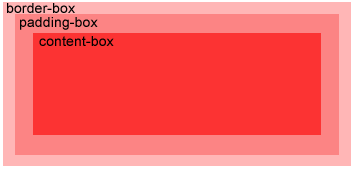

### CSS背景
- background-color
- background-image
- background-repeat 设置背景图像是否及如何重复。

    |值|说明|
    |--|--|
    |repeat|背景图像将向垂直和水平方向重复。这是默认|
    |repeat-x|只有水平位置会重复背景图像|
    |repeat-y|只有垂直位置会重复背景图像|
    |no-repeat|background-image不会重复|
    |inherit|指定background-repea属性设置应该从父元素继承|
- background-attachment 背景图像是否固定或者随着页面的其余部分滚动。
    |值|说明|
    |--|--|
    |scroll|背景图片随着页面的滚动而滚动，这是默认的。|
    |fixed|背景图片不会随着页面的滚动而滚动。|
    |local|背景图片会随着元素内容的滚动而滚动。|
    |initial|
    |inherit|指定 background-attachment 的设置应该从父元素继承。|
- background-position 设置背景图像的起始位置。

### CSS文本
文本颜色 color
文本方向 direction
字符间距 letter-spacing
行高 line-height
对齐元素中的文本 text-align
向文本添加修饰 text-decoration
缩进元素中文本的首行 text-indent
文本阴影 text-shadow
控制元素中的字母 text-transform
设置或返回文本是否被重写 unicode-bidi
元素垂直对齐 vertical-align
元素中空白的处理方式 white-space
设置字间距 word-spacing

### CSS字体
font 字体的全部属性
font-family 字体
font-size   字体大小
font-style  字体的样式
比如：
- italic
- oblique
- inherit
font-variant 以小型大写字体或者正常字体现实文本
font-weight 字体的粗细

### CSS链接
a:link 正常，未访问过的链接
a:visited  用户已访问过的链接
a:hover 当用户鼠标放在链接上时
a:active 链接被点击的那一刻

### CSS列表
list-style 简写属性。所有用于列表的属性设置于一个声明中。
list-style-image 将图像设置为列表项标志
list-style-position 列表项标志的位置
- inside
- outside 
- inherit
list-style-type 列表项标志的类型
- circle
- square
- upper-roman
- lower-alpha

### CSS表格

```css
//表格边框
table, th, td{
    border: 1px solid black;
}

//折叠边框
//上边的表格因为th，td有独立的边界所有有双边框
table{
    border-collapse: collapse;
}

//高度和宽度
table{
    width:100%;
}
th{
    height: 50px;
}

//文字对齐
td{
    text-align:right;
}
//垂直对齐
td{
    height:50px;
    vertical-align: bottom;
}
```
### CSS盒子模型
Margin 外边距
Border 边框
Padding 内边距
Content 内容

### border
border-style
- dotted 点线边框
- dashed 虚线边框
- solid 实线
- double
- groove 3D沟槽边框
- ridge 3D脊边框
- inset 3D嵌入式边框
- outset 3D突出式边框
border-width
border-color
边框可以单独设置各边的样式，顺序分别为上右下左，上（左右）下，（上下）（左右）

### CSS outline轮廓
outline是绘于元素周围的一条线，位于边框的外围，可起到突出元素的作用。
outline
outline-color
outline-style
outline-width

### 组合器
|Combination|Select|
|--|--|
|A,B| 匹配满足A（和或）B的任意元素|
|A B| 匹配任意元素，满足条件：B是A的后代节点（子节点或者子节点的子节点）|
|A > B| B是A的子节点
|A + B| B是A的下一个兄弟节点（AB有相同的父节点，并且B紧跟在A后面）|
|A ~ B| B是之后的兄弟节点的任意一个

### 尺寸
height
line-height
max-height
max-width
min-height
min-width
width

### Position 位置
- static: HTML元素的默认值，即没有定位，遵循正常的文档流对象
静态定位的元素不会受到bot，top，left，right影响
- fixed: 元素的位置相对于浏览器窗口是固定位置，即使窗口是滚动的他也不会动
- relative：相对定位元素的定位是相对其正常位置
- absolute：绝对定位元素的位置相对于最近的已定位父元素，如果元素没有已定位的父元素，那么他的位置相对于<html>
- sticky：基于用户的滚动位置来定，粘性
重叠的元素
元素的位置与文档流无关，所以他们可以有覆盖页面上的其他元素
z-index属性定义了一个元素的对铁顺序（哪个元素应该放在前面或者后面）
一个元素可以有正数或负数的堆叠顺序
```css
img{
    position:absolute;
    left:0px;
    top:0px;
    z-index:-1;
}
```

### Overflow 溢出
- visible
- hidden
- scroll 会被剪枝，但是浏览器会显示混动条以便查看其余内容
- auto 如果内容被剪枝，则浏览器会显示滚动条以便查看其余的内容
- inherit

### CSS浮动
浮动会使元素向左或右移动，其周围的元素也会重新排列。Float往往用于图像，但它在布局时一样有用。
|属性|描述|值|
|--|--|--|
|clear|不允许元素周围有浮动元素|left,right,both,none,inherit|
|float|指定一个盒子是否可以浮动|left,right,none,inherit|

### CSS对齐
元素居中对齐可以用 <code>margin：auto</code>
文本居中对齐，可以用<code>text-align: center</code>
图片对齐用 <code>margin：auto</code>并把它放到块元素中

左右对齐
可以用<code>position: absolute</code>属性来对齐元素
也可以用float属性来对齐元素

垂直居中，使用padding或者line-height
多行文本可以使用<code>vertical-align</code>来实现元素的垂直居中。需要解决溢出问题。


### 伪类
https://www.runoob.com/css/css-pseudo-classes.html

### 伪元素
https://www.runoob.com/css/css-pseudo-elements.html

### CSS提示工具
https://www.runoob.com/css/css-tooltip.html

### 图像透明、不透明
opacity

### CSS媒体类型
一些 CSS 属性只设计了某些媒体。例如 voice-family 属性是专为听觉用户代理。其他一些属性可用于不同的媒体类型。例如， font-size 属性可用于屏幕和印刷媒体，但有不同的值。屏幕和纸上的文件不同，通常需要一个更大的字体，sans-serif 字体比较适合在屏幕上阅读，而 serif 字体更容易在纸上阅读。
@media规则
```css
@media screen
{
    p.test {font-family:verdana,sans-serif;font-size:14px;}
}
@media print
{
    p.test {font-family:times,serif;font-size:10px;}
}
@media screen,print
{
    p.test {font-weight:bold;}
}
```
# CSS属性选择器
属性选择器
```css
//属性选择器
//把包含标题的所有元素变为蓝色
[title]
{
    color:blue;
}

//属性和值选择器
//下面的实例改变了标题title='runoob'元素的边框样式:
[title=runoob]
{
    border:5px solid green;
}

//属性和值的选择器 - 多值
//下面是包含指定值的title属性的元素样式的例子，使用（~）分隔属性和值:
[title~=hello] { color:blue; }
//下面是包含指定值的lang属性的元素样式的例子，使用（|）分隔属性和值:
[lang|=en] { color:blue; }

//表单样式
//属性选择器样式无需使用class或id的形式:
input[type="text"]
{
    width:150px;
    display:block;
    margin-bottom:10px;
    background-color:yellow;
}
input[type="button"]
{
    width:120px;
    margin-left:35px;
    display:block;
}
```

### CSS表单
https://www.runoob.com/css/css-form.html

### CSS计数器
```css
body {
  counter-reset: section;
}
 
h2::before {
  counter-increment: section;
  content: "Section " counter(section) ": ";
}
```
嵌套计数器
```css
body {
  counter-reset: section;
}
 
h1 {
  counter-reset: subsection;
}
 
h1::before {
  counter-increment: section;
  content: "Section " counter(section) ". ";
}
 
h2::before {
  counter-increment: subsection;
  content: counter(section) "." counter(subsection) " ";
}
```

有其他问题查看
https://www.runoob.com/css/css-examples.html

## CSS3
### CSS3边框
- border-radius 创建圆角
    如果你要在四个角上意义指定，可以用以下规则：
    - 四个值: 第一个值为左上角，第二个值为右上角，第三个值为右下角，第四个值为左下角。
    - 三个值: 第一个值为左上角, 第二个值为右上角和左下角，第三个值为右下角
    - 两个值: 第一个值为左上角与右下角，第二个值为右上角与左下角
- box-shadow 用来添加阴影
- border-image 使用图像创建一个边框

### CSS3 background
- background-image属性
CSS3中可以通过background-image属性添加背景图片
不同的背景图像和图像用逗号隔开，所有的图片中显示在最顶端的为第一张。
```css
#example1 { 
    background-image: url(img_flwr.gif), url(paper.gif); 
    background-position: right bottom, left top; 
    background-repeat: no-repeat, repeat; 
}
#example1 {
    background: url(img_flwr.gif) right bottom no-repeat, url(paper.gif) left top repeat;
}
```
- background-size
- background-origin 制定了背景图像的位置区域
    
- background-clip 背景剪裁属性是从指定位置开始绘制


### CSS渐变
线性渐变
background-image: linear-gradient(direction, color-stop1, color-stop2, ...);
```css
//从左到右
#grad {
  height: 200px;
  background-image: linear-gradient(to right, red , yellow);
}
//从左上角到右下角
#grad {
  height: 200px;
  background-image: linear-gradient(to bottom right, red, yellow);
}
//使用多个颜色节点
#grad {
  /* 标准的语法 */
  background-image: linear-gradient(to right, red,orange,yellow,green,blue,indigo,violet);
}
//使用透明度
#grad {
  background-image: linear-gradient(to right, rgba(255,0,0,0), rgba(255,0,0,1));
}
//重复的线性渐变
#grad {
  /* 标准的语法 */
  background-image: repeating-linear-gradient(red, yellow 10%, green 20%);
}
```
### CSS3文本效果
- 文本阴影
```css
//指定水平阴影，垂直阴影，模糊的距离，以及阴影的颜色
h1
{
    text-shadow: 5px 5px 5px #FF0000;
}
```
box-shadow属性
```css
div {
    box-shadow: 10px 10px 5px #888888;
}
```
text-overflow属性
```css
// 被剪裁的文本显示未‘...’
p.test1 {
    white-space: nowrap; 
    width: 200px; 
    border: 1px solid #000000;
    overflow: hidden;
    text-overflow: clip; 
}
// 直接剪裁 
p.test2 {
    white-space: nowrap; 
    width: 200px; 
    border: 1px solid #000000;
    overflow: hidden;
    text-overflow: ellipsis; 
}
```
css3的换行
如果某个单词太长，不适合在一个区域内，它扩展到外面：
CSS3中，自动换行属性允许您强制文本换行 - 即使这意味着分裂它中间的一个字：
```css
p {word-wrap:break-word;}
```
### css字体
使用以前 CSS 的版本，网页设计师不得不使用用户计算机上已经安装的字体。
使用 CSS3，网页设计师可以使用他/她喜欢的任何字体。
在新的 @font-face 规则中，您必须首先定义字体的名称（比如 myFirstFont），然后指向该字体文件。
```css
<style> 
@font-face
{
    font-family: myFirstFont;
    src: url(sansation_light.woff);
}
 
div
{
    font-family:myFirstFont;
}
</style>

//使用粗体字，您必须添加另一个包含粗体文字的@font-face规则：
@font-face
{
    font-family: myFirstFont;
    src: url(sansation_bold.woff);
    font-weight:bold;
}
```
### 2D转换
- translate() 根据左（X轴）和顶部（Y轴）位置给定的参数，从当前元素位置移动
  ```css
  div
  {
  transform: translate(50px,100px);
  -ms-transform: translate(50px,100px); /* IE 9 */
  -webkit-transform: translate(50px,100px); /* Safari and Chrome */
  }
  ```
- rotate() 在一个给定度数顺时针旋转的元素。负值是允许的，这样是元素逆时针旋转。
  ```css
  div{
  transform: rotate(30deg);
  -ms-transform: rotate(30deg); /* IE 9 */
  -webkit-transform: rotate(30deg); /* Safari and Chrome */
  }
  ```
- scale() 该元素增加或减少的大小，取决于宽度（X轴）和高度（Y轴）的参数：
  ```css
  -ms-transform:scale(2,3); /* IE 9 */
  -webkit-transform: scale(2,3); /* Safari */
  transform: scale(2,3); /* 标准语法 */
  ```
- skew() 分别表示X轴和Y轴倾斜的角度，如果第二个参数为空，则默认为0，参数为负表示向相反方向倾斜。
  语法：transform:skew(\<angle> [,\<angle>]);
  - skewX(<angle>);表示只在X轴(水平方向)倾斜。
  - skewY(<angle>);表示只在Y轴(垂直方向)倾斜。
  ```css
  div{
  transform: skew(30deg,20deg);
  -ms-transform: skew(30deg,20deg); /* IE 9 */
  -webkit-transform: skew(30deg,20deg); /* Safari and Chrome */
  }
  ```
  skew(30deg,20deg) 元素在X轴和Y轴上倾斜20度30度。
- matrix()
  matrix()方法将2D变换方法合并成一个。
  matrix 方法有六个参数，包含旋转，缩放，移动（平移）和倾斜功能。
  ```css
  div
  {
  transform:matrix(0.866,0.5,-0.5,0.866,0,0);
  -ms-transform:matrix(0.866,0.5,-0.5,0.866,0,0); /* IE 9 */
  -webkit-transform:matrix(0.866,0.5,-0.5,0.866,0,0); /* Safari and Chrome */
  }
  ```
转换属性：
- transform
- transform-origin 允许你改变被转换元素的位置。	
- transform-style 规定被嵌套元素如何在 3D 空间中显示。	
- perspective 规定 3D 元素的透视效果。	
- perspective-origin 规定 3D 元素的底部位置。	
- backface-visibility 定义元素在不面对屏幕时是否可见。	

### CSS3过度
CSS3 过渡是元素从一种样式逐渐改变为另一种的效果。
要实现这一点，必须规定两项内容：
指定要添加效果的CSS属性
指定效果的持续时间。
```css
div
{
	width:100px;
	height:100px;
	background:red;
	transition:width 2s;
	-webkit-transition:width 2s; /* Safari */
}

div:hover
{
	width:300px;
}
```
多项改变
```css
div
{
    transition: width 2s, height 2s, transform 2s;
    -webkit-transition: width 2s, height 2s, -webkit-transform 2s;
}
```
过渡属性
- transition
- transition-property
- transition-duration
- transition-timing-function
- transition-delay
### css3动画
@keyframes规则是创建动画
```css
@keyframes myfirst
{
    from {background: red;}
    to {background: yellow;}
}
 
@-webkit-keyframes myfirst /* Safari 与 Chrome */
{
    from {background: red;}
    to {background: yellow;}
}
```
创建完动画后，把它绑定到一个选择器，否则动画不会有任何效果
```css
div
{
    animation: myfirst 5s;
    -webkit-animation: myfirst 5s; /* Safari 与 Chrome */
}
```
|属性|描述|
|--|--|
|@keyframes|规定动画。	
|animation|所有动画属性的简写属性。	
|animation-name|规定 @keyframes 动画的名称。	
|animation-duration|规定动画完成一个周期所花费的秒或毫秒。默认是 0。	
|animation-timing-function|规定动画的速度曲线。默认是 "ease"。	
|animation-fill-mode|规定当动画不播放时（当动画完成时，或当动画有一个延迟未开始播放时），要应用到元素的样式。	
|animation-delay|规定动画何时开始。默认是 0。	
|animation-iteraction-count|规定动画被播放的次数。默认是 1。	
|animation-direction|规定动画是否在下一周期逆向地播放。默认是 "normal"。	
|animation-play-state|规定动画是否正在运行或暂停。默认是 "running"。	

### CSS3多列属性
- column-count
  ```css
  div {
      -webkit-column-count: 3; /* Chrome, Safari, Opera */
      -moz-column-count: 3; /* Firefox */
      column-count: 3;
  }
  ```
- column-gap 多列中列与列间的间隙
- column-rule-style 属性指定了列与列间的边框样式
- column-rule-width 属性指定了两列的边框厚度
- column-rule-color
- column-rule
- column-span 指定元素跨越多少列
- column-width 指定了列的宽度

### CSS3用户界面
- CSS3调整尺寸
CSS3中，resize属性指定一个元素是否应该由用户去调整大小。
- CSS3方框大小调整
box-sizing 属性允许您以确切的方式定义适应某个区域的具体内容。
https://www.runoob.com/css3/css3-box-sizing.html
- CSS3 外形修饰
outline-offset 属性对轮廓进行偏移，并在超出边框边缘的位置绘制轮廓。
  ```css
  //这个 div 在边框之外 15 像素处有一个轮廓。
  div
  {
      border:2px solid black;
      outline:2px solid red;
      outline-offset:15px;
  }
  ```
### CSS 图片
圆角图片
```css
img {
    border-radius: 8px;
}
```
椭圆形图片
```css
img {
    border-radius: 50%;
}
```
响应式图片
如果你需要自由缩放图片，且图片放大的尺寸不大于其原始的最大值，则可使用以下代码：
```css
img {
    max-width: 100%;
    height: auto;
}
```
[图片文本](https://www.runoob.com/try/try.php?filename=trycss_image_text_top_left)
[卡片式图片](https://www.runoob.com/try/try.php?filename=trycss_ex_images_card)
[响应式图片相册](https://www.runoob.com/try/try.php?filename=trycss_image_gallery_responsive)
[图片Model](https://www.runoob.com/try/try.php?filename=trycss_image_modal_js)

### 按钮
按钮动画
- 鼠标移动到按钮上后添加箭头标记:
https://www.runoob.com/try/try.php？filename=trycss_buttons_animate1
- 点击时添加 "波纹" 效果:
https://www.runoob.com/try/try.php?filename=trycss_buttons_animate2
- 点击时添加 "压下" 效果:
https://www.runoob.com/try/try.php?filename=trycss_buttons_animate3

### CSS分页
https://www.runoob.com/css3/css3-pagination.html#

### 弹性盒子
https://www.runoob.com/css3/css3-flexbox.html

### CSS多媒体查询
多媒体查询由多种媒体组成，可以包含一个或多个表达式，表达式根据条件是否成立返回 true 或 false。
```css
@media not|only mediatype and (expressions) {
    CSS 代码...;
}
```
你也可以在不同的媒体上使用不同的样式文件：
```html
<link rel="stylesheet" media="mediatype and|not|only (expressions)" href="print.css">
```
更多实例
https://www.runoob.com/css3/css3-mediaqueries-ex.html