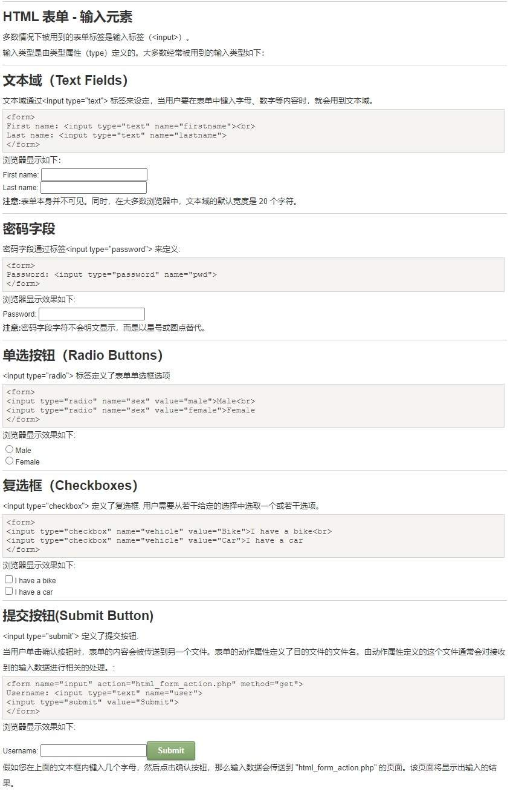
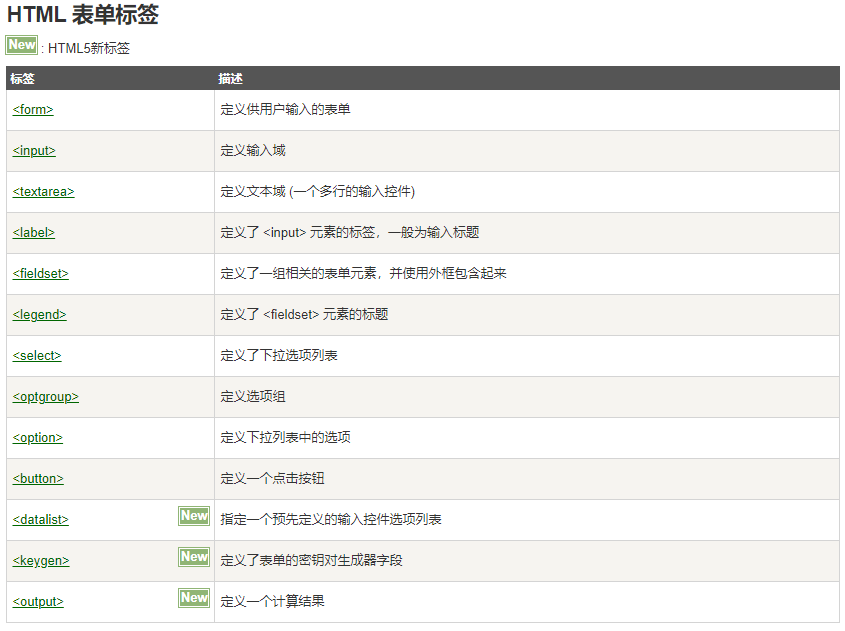
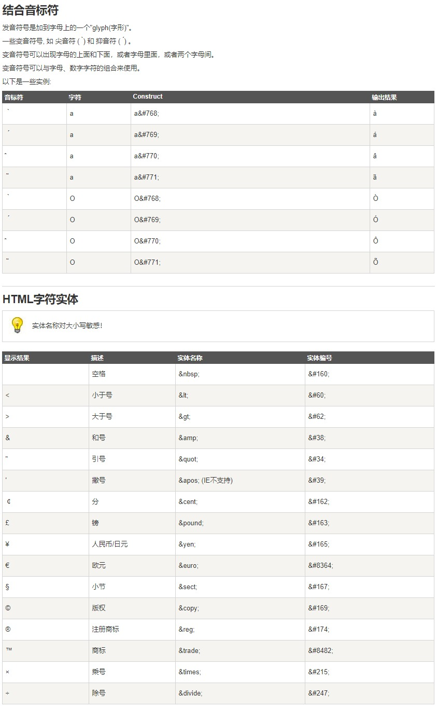
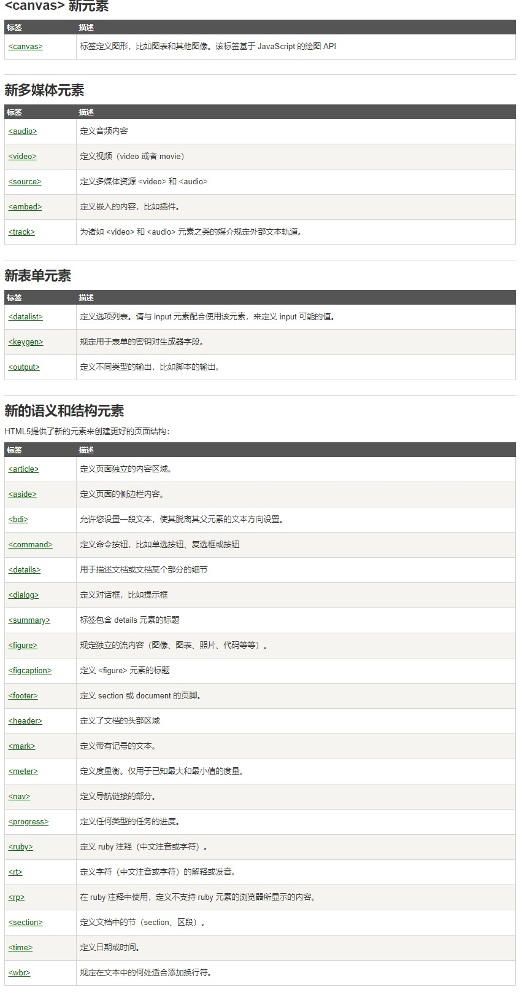

HTML段落
```html
<p></p>
```
HTML折行
```html
<br>
```
HTML水平线
```html
<hr>
```
HTML链接
```html
<a href="url">链接文本</a>
<!-- 使用 target 属性，你可以定义被链接的文档在何处显示。-->
<a href="https://www.runoob.com/" target="_blank" rel="noopener noreferrer">访问菜鸟教程!</a>
<!-- 在HTML文档中创建一个链接到"有用的提示部分(id="tips"）"： -->
<a id="tips">有用的提示部分</a>
<a href="#tips">访问有用的提示部分</a>
<!-- 或者，从另一个页面创建一个链接到"有用的提示部分(id="tips"）"： -->
<a href="https://www.runoob.com/html/html-links.html#tips">
```
HTML头部
- HTML\<base> 元素
<base> 标签描述了基本的链接地址/链接目标，该标签作为HTML文档中所有的链接标签的默认链接:
```html
<base href="http://www.runoob.com/images/" target="_blank">
```
- HTML \<link> 元素
<link> 标签定义了文档与外部资源之间的关系。
```html
<link rel="stylesheet" type="text/css" href="mystyle.css">
```
- HTML <meta> 元素
meta标签描述了一些基本的元数据。

HTML图像
```html

<!-- 定义图像地图 -->
<map></map>
<!-- 定义图像地图中的可点击区域 -->
<area>
```
HTML表单



HTML框架
通过使用框架，你可以在同一个浏览器窗口中显示不止一个页面。
```html
<iframe src="URL"></iframe>
<!-- 该URL指向不同的网页。 -->
```
HTML字符


### HTML5新元素

### HTML5拖放
draggable
###  
