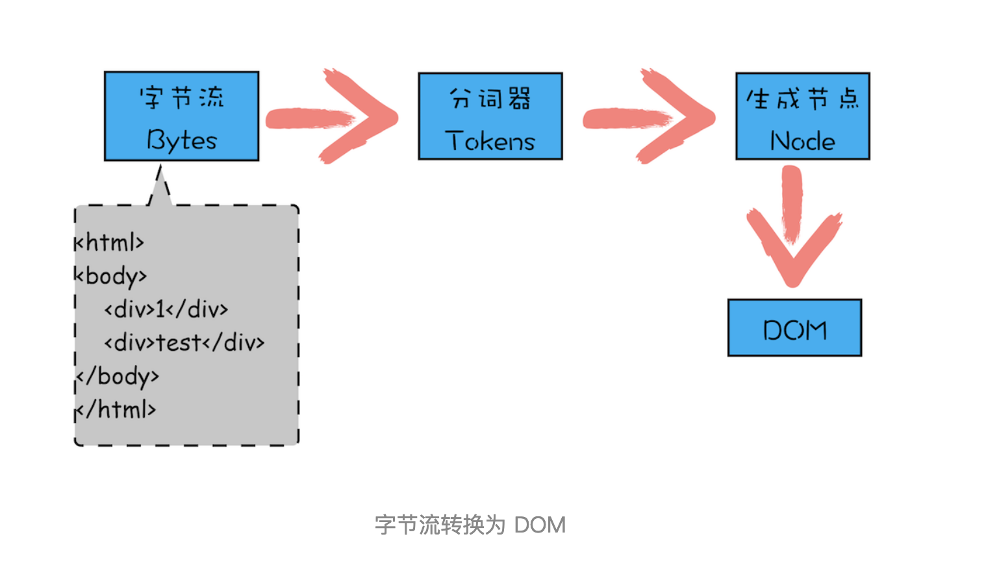

## 跨标签通信
1. BroadCast Channel
BroadCast Channel 可以帮我们创建一个用于广播的通信频道。当所有页面都监听同一频道的消息时，其中某一个页面通过它发送的消息就会被其他所有页面收到。它的API和用法都非常简单。
```javascript
//下面的方式就可以创建一个标识为AlienZHOU的频道：
const bc = new BroadcastChannel('AlienZHOU');
//各个页面可以通过onmessage来监听被广播的消息：
bc.onmessage = function (e) {
    const data = e.data;
    const text = '[receive] ' + data.msg + ' —— tab ' + data.from;
    console.log('[BroadcastChannel] receive message:', text);
};
//要发送消息时只需要调用实例上的postMessage方法即可：
bc.postMessage(mydata);
```
2. Service Worker
Service Worker 是一个可以长期运行在后台的 Worker，能够实现与页面的双向通信。多页面共享间的 Service Worker 可以共享，将 Service Worker 作为消息的处理中心（中央站）即可实现广播效果。
```javascript
//首先，需要在页面注册 Service Worker：
navigator.serviceWorker.register('../util.sw.js').then(function () {
    console.log('Service Worker 注册成功');
});
//其中../util.sw.js是对应的 Service Worker 脚本。Service Worker 本身并不自动具备“广播通信”的功能，需要我们添加些代码，将其改造成消息中转站：
/* ../util.sw.js Service Worker 逻辑 */
self.addEventListener('message', function (e) {
    console.log('service worker receive message', e.data);
    e.waitUntil(
        self.clients.matchAll().then(function (clients) {
            if (!clients || clients.length === 0) {
                return;
            }
            clients.forEach(function (client) {
                client.postMessage(e.data);
            });
        })
    );
});
```
我们在 Service Worker 中监听了message事件，获取页面（从 Service Worker 的角度叫 client）发送的信息。然后通过self.clients.matchAll()获取当前注册了该 Service Worker 的所有页面，通过调用每个client（即页面）的postMessage方法，向页面发送消息。这样就把从一处（某个Tab页面）收到的消息通知给了其他页面。
```javascript
//处理完 Service Worker，我们需要在页面监听 Service Worker 发送来的消息：
navigator.serviceWorker.addEventListener('message', function (e) {
    const data = e.data;
    const text = '[receive] ' + data.msg + ' —— tab ' + data.from;
    console.log('[Service Worker] receive message:', text);
});
//最后，当需要同步消息时，可以调用 Service Worker 的postMessage方法：
navigator.serviceWorker.controller.postMessage(mydata);
```

3. LocalStorage
当 LocalStorage 变化时，会触发storage事件。利用这个特性，我们可以在发送消息时，把消息写入到某个 LocalStorage 中；然后在各个页面内，通过监听storage事件即可收到通知。
```javascript
window.addEventListener('storage', function (e) {
    if (e.key === 'ctc-msg') {
        const data = JSON.parse(e.newValue);
        const text = '[receive] ' + data.msg + ' —— tab ' + data.from;
        console.log('[Storage I] receive message:', text);
    }
});
// 在各个页面添加如上的代码，即可监听到 LocalStorage 的变化。当某个页面需要发送消息时，只需要使用我们熟悉的setItem方法即可：
mydata.st = +(new Date);
window.localStorage.setItem('ctc-msg', JSON.stringify(mydata));
```

## 前端路由
在单页面web网页中, 单纯的浏览器地址改变, 网页不会重载，如单纯的hash网址改变网页不会变化，因此我们的路由主要是通过监听事件，并利用js实现动态改变网页内容，有两种实现方式：
- hash模式：监听浏览器地址hash值变化，执行相应的js切换网页；
- history模式：利用history API实现url地址改变，网页内容改变；
### hash模式
 使用window.location.hash属性及窗口的onhashchange事件，可以实现监听浏览器地址hash值变化，执行相应的js切换网页。下面具体介绍几个使用过程中必须理解的要点：

- hash指的是地址中#号以及后面的字符，也称为散列值。hash也称作锚点，本身是用来做页面跳转定位的。如http://localhost/index.html#abc，这里的#abc就是hash；
- 散列值是不会随请求发送到服务器端的，所以改变hash，不会重新加载页面；
- 监听 window 的 hashchange 事件，当散列值改变时，可以通过 location.hash 来获取和设置hash值；
- location.hash值的变化会直接反应到浏览器地址栏；
#### 触发hashchange事件的几种情况：
- 浏览器地址栏散列值的变化（包括浏览器的前进、后退）会触发window.location.hash值的变化，从而触发onhashchange事件；
- 当浏览器地址栏中URL包含哈希如 http://www.baidu.com/#home，这时按下输入，浏览器发送http://www.baidu.com/请求至服务器，请求完毕之后设置散列值为#home，进而触发onhashchange事件；
- 当只改变浏览器地址栏URL的哈希部分，这时按下回车，浏览器不会发送任何请求至服务器，这时发生的只是设置散列值新修改的哈希值，并触发onhashchange事件；
- html中\<a>标签的属性 href 可以设置为页面的元素ID如 #top，当点击该链接时页面跳转至该id元素所在区域，同时浏览器自动设置 window.location.hash 属性，地址栏中的哈希值也会发生改变，并触发onhashchange事件；
```javascript
window.location.hash='abc';
let hash = window.location.hash //'#abc'

window.addEventListener('hashchange',function(){
	//监听hash变化，点击浏览器的前进后退会触发
})
```
### history模式
- window.history 属性指向 History 对象，它表示当前窗口的浏览历史。当发生改变时，只会改变页面的路径，不会刷新页面。
- History 对象保存了当前窗口访问过的所有页面网址。通过 history.length 可以得出当前窗口一共访问过几个网址。
- 由于安全原因，浏览器不允许脚本读取这些地址，但是允许在地址之间导航。
- 浏览器工具栏的“前进”和“后退”按钮，其实就是对 History 对象进行操作
#### 属性
History 对象主要有两个属性。

- History.length：当前窗口访问过的网址数量（包括当前网页）
- History.state：History 堆栈最上层的状态值（详见下文）

#### 方法
History.back()、History.forward()、History.go()
- History.back()：移动到上一个网址，等同于点击浏览器的后退键。对于第一个访问的网址，该方法无效果。
- History.forward()：移动到下一个网址，等同于点击浏览器的前进键。对于最后一个访问的网址，该方法无效果。
- History.go()：接受一个整数作为参数，以当前网址为基准，移动到参数指定的网址。如果参数超过实际存在的网址范围，该方法无效果；如果不指定参数，默认参数为0，相当于刷新当前页面。

## DOM
Documnent Object Model文本对象模型
在渲染引擎内部，有一个叫HTML 解析器（HTMLParser）的模块，它的职责就是负责将 HTML 字节流转换为 DOM 结构。所以这里我们需要先要搞清楚 HTML 解析器是怎么工作的。在渲染引擎内部，有一个叫HTML 解析器（HTMLParser）的模块，它的职责就是负责将 HTML 字节流转换为 DOM 结构。所以这里我们需要先要搞清楚 HTML 解析器是怎么工作的。
字节流是如何转换成DOM的

- 第一个阶段，通过分词器将字节流转换为 Token。
- 至于后续的第二个和第三个阶段是同步进行的，需要将 Token 解析为 DOM 节点，并将 DOM 节点添加到 DOM 树中。
    > HTML 解析器维护了一个Token 栈结构，该 Token 栈主要用来计算节点之间的父子关系，在第一个阶段中生成的 Token 会被按照顺序压到这个栈中。具体的处理规则如下所示:
    - 如果压入到栈中的是StartTag Token，HTML 解析器会为该 Token 创建一个 DOM 节点，然后将该节点加入到 DOM 树中，它的父节点就是栈中相邻的那个元素生成的节点。
    - 如果分词器解析出来是文本 Token，那么会生成一个文本节点，然后将该节点加入到 DOM 树中，文本 Token 是不需要压入到栈中，它的父节点就是当前栈顶 Token 所对应的 DOM 节点。
    - 如果分词器解析出来的是EndTag 标签，比如是 EndTag div，HTML 解析器会查看 Token 栈顶的元素是否是 StarTag div，如果是，就将 StartTag div 从栈中弹出，表示该 div 元素解析完成。
#### JavaScript 是如何影响 DOM 生成的
我在两段 div 中间插入了一段 JavaScript 脚本，这段脚本的解析过程就有点不一样了。script标签之前，所有的解析流程还是和之前介绍的一样，但是解析到script标签时，渲染引擎判断这是一段脚本，此时 HTML 解析器就会暂停 DOM 的解析，因为接下来的 JavaScript 可能要修改当前已经生成的 DOM 结构。这时候 HTML 解析器暂停工作，JavaScript 引擎介入，并执行 script 标签中的这段脚本，因为这段 JavaScript 脚本修改了 DOM 中第一个 div 中的内容，所以执行这段脚本之后，div 节点内容已经修改为 time.geekbang 了。脚本执行完成之后，HTML 解析器恢复解析过程，继续解析后续的内容，直至生成最终的 DOM。


## 事件模型
#### 1. EventTarget接口
addEventListener：绑定事件的监听函数
removeEventListener：移除事件的监听函数
dispatchEvent：触发事件
target.addEventListener(type, listener[, useCapture]);
> - type：事件名称，大小写敏感。
> - listener：监听函数。事件发生时，会调用该监听函数。
> - useCapture：布尔值，表示监听函数是否在捕获阶段（capture）触发（参见后文《事件的传播》部分），默认为false（监听函数只在冒泡阶段被触发）。该参数可选。

首先，第二个参数除了监听函数，还可以是一个具有handleEvent方法的对象。
其次，第三个参数除了布尔值useCapture，还可以是一个属性配置对象。该对象有以下属性。
addEventListener方法可以为针对当前对象的同一个事件，添加多个不同的监听函数。这些函数按照添加顺序触发，即先添加先触发。如果为同一个事件多次添加同一个监听函数，该函数只会执行一次，多余的添加将自动被去除（不必使用removeEventListener方法手动去除）。

EventTarget.removeEventListener()
removeEventListener方法的参数，与addEventListener方法完全一致。它的第一个参数“事件类型”，大小写敏感。
注意，removeEventListener方法移除的监听函数，必须是addEventListener方法添加的那个监听函数，而且必须在同一个元素节点，否则无效。

EventTarget.dispatchEvent()
EventTarget.dispatchEvent()方法在当前节点上触发指定事件，从而触发监听函数的执行。该方法返回一个布尔值，只要有一个监听函数调用了Event.preventDefault()，则返回值为false，否则为true。
如果dispatchEvent方法的参数为空，或者不是一个有效的事件对象，将报错。

下面代码根据dispatchEvent方法的返回值，判断事件是否被取消了。

#### 2. 监听函数
2.1 HTML 的 on- 属性
```javascript
<body onload="doSomething()">
<div onclick="console.log('触发事件')">
//or
el.setAttribute('onclick', 'doSomething()');
```
2.2 元素节点的事件属性
```javascript
window.onload = doSomething;

div.onclick = function (event) {
  console.log('触发事件');
};
```
2.3 EventTarget.addEventListener()


#### 3. this的指向
监听函数内部的this指向触发事件的那个元素节点。

#### 4. 时间的传播
一个事件发生后，会在子元素和父元素之间传播（propagation）。这种传播分成三个阶段。
> 第一阶段：从window对象传导到目标节点（上层传到底层），称为“捕获阶段”（capture phase）。
第二阶段：在目标节点上触发，称为“目标阶段”（target phase）。
第三阶段：从目标节点传导回window对象（从底层传回上层），称为“冒泡阶段”（bubbling phase）。

#### 5. 事件的代理
由于事件会在冒泡阶段向上传播到父节点，因此可以把子节点的监听函数定义在父节点上，由父节点的监听函数统一处理多个子元素的事件。这种方法叫做事件的代理（delegation）。

## 浏览器的缓存机制
