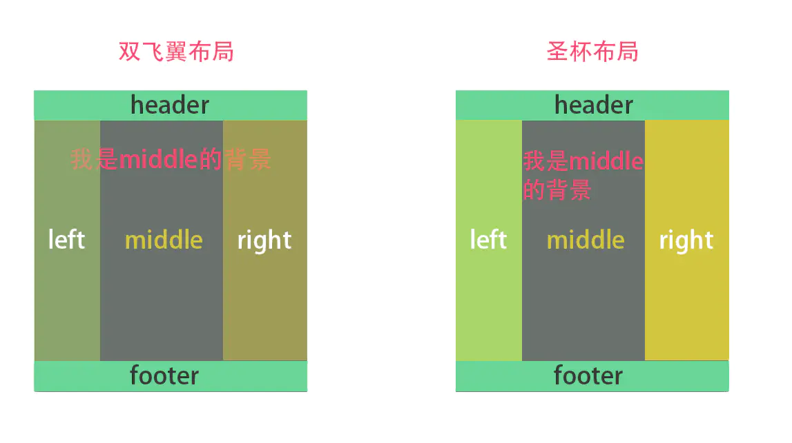

## BFC
具有 BFC 特性的元素可以看作是隔离了的独立容器，容器里面的元素不会在布局上影响到外面的元素，并且 BFC 具有普通容器所没有的一些特性。
- 触发BFC
只要元素满足下面任一条件即可触发 BFC 特性：
    body 根元素
    浮动元素：float 除 none 以外的值
    绝对定位元素：position (absolute、fixed)
    display 为 inline-block、table-cells、flex
    overflow 除了 visible 以外的值 (hidden、auto、scroll)
- BFC特性及应用
    1. 同一个BFC下外边距会发生折叠
    如果想要避免外边距的重叠，可以将其放在不同的 BFC 容器中。
    2. BFC 可以包含浮动的元素（清除浮动）
    3. BFC 可以阻止元素被浮动元素覆盖

## flex
Flexible Box 模型，通常被称为 flexbox，是一种一维的布局模型。它给 flexbox 的子元素之间提供了强大的空间分布和对齐能力。本文给出了 flexbox 的主要特性，更多的细节将在别的文档中探索。

### flex的两根轴线
主轴
flex-direction，可以取四个值：row, row-reverse,column,column-reverse
交叉轴
交叉轴垂直于主轴，所以如果你的flex-direction (主轴) 设成了 row 或者 row-reverse 的话，交叉轴的方向就是沿着列向下的。如果主轴方向设成了 column 或者column-reverse，交叉轴就是水平方向。

### flex容器
文档中采用了 flexbox 的区域就叫做 flex 容器。为了创建 flex 容器， 我们把一个容器的 display 属性值改为 flex 或者 inline-flex。 完成这一步之后，容器中的直系子元素就会变为 flex 元素。所有CSS属性都会有一个初始值，所以 flex 容器中的所有 flex 元素都会有下列行为：
    
    元素排列为一行 (flex-direction 属性的初始值是 row)。
    元素从主轴的起始线开始。
    元素不会在主维度方向拉伸，但是可以缩小。
    元素被拉伸来填充交叉轴大小。
    flex-basis 属性为 auto。
    flex-wrap 属性为 nowrap。
#### 用flex-warp实现多行flex容器
### flex元素上的属性
- flex-grow
    若被赋值为一个正整数， flex 元素会以 flex-basis 为基础，沿主轴方向增长尺寸。这会使该元素延展，并占据此方向轴上的可用空间（available space）。如果有其他元素也被允许延展，那么他们会各自占据可用空间的一部分。

    如果我们给上例中的所有元素设定 flex-grow 值为1， 容器中的可用空间会被这些元素平分。它们会延展以填满容器主轴方向上的空间。
- flex-shrink
    flex-grow属性是处理flex元素在主轴上增加空间的问题，相反flex-shrink属性是处理flex元素收缩的问题。如果我们的容器中没有足够排列flex元素的空间，那么可以把flex元素flex-shrink属性设置为正整数来缩小它所占空间到flex-basis以下。与flex-grow属性一样，可以赋予不同的值来控制flex元素收缩的程度 —— 给flex-shrink属性赋予更大的数值可以比赋予小数值的同级元素收缩程度更大。
- flex-basis
     flex-basis 定义了该元素的空间大小（the size of that item in terms of the space），flex容器里除了元素所占的空间以外的富余空间就是可用空间 available space。 该属性的默认值是 auto 。此时，浏览器会检测这个元素是否具有确定的尺寸。 在上面的例子中, 所有元素都设定了宽度（width）为100px，所以 flex-basis 的值为100px。
#### flex属性的简写
你可能很少看到 flex-grow，flex-shrink，和 flex-basis 属性单独使用，而是混合着写在 flex 简写形式中。 Flex 简写形式允许你把三个数值按这个顺序书写 — flex-grow，flex-shrink，flex-basis。
```css
.one {
        flex: 1 1 auto;
      }
```
flex: initial 是把flex元素重置为Flexbox的初始值，它相当于 flex: 0 1 auto。在这里 flex-grow 的值为0，所以flex元素不会超过它们 flex-basis 的尺寸。flex-shrink 的值为1, 所以可以缩小flex元素来防止它们溢出。flex-basis 的值为 auto. Flex元素尺寸可以是在主维度上设置的，也可以是根据内容自动得到的。

flex: auto 等同于 flex: 1 1 auto；和上面的 flex:initial 基本相同，但是这种情况下，flex元素在需要的时候既可以拉伸也可以收缩。

flex: none 可以把flex元素设置为不可伸缩。它和设置为 flex: 0 0 auto 是一样的。元素既不能拉伸或者收缩，但是元素会按具有 flex-basis: auto 属性的flexbox进行布局。

你在教程中常看到的 flex: 1 或者 flex: 2 等等。它相当于flex: 1 1 0。元素可以在flex-basis为0的基础上伸缩。

### 元素间的对齐和空间分配
align-items
align-items 属性可以使元素在交叉轴方向对齐。
align-items: stretch || flex-start || flex-end || center
justify-content
justify-content属性用来使元素在主轴方向上对齐，主轴方向是通过 flex-direction 设置的方向。
stretch || flex-start || flex-end || center || space-around || space-between

## 双飞翼/圣杯布局

圣杯布局

1. 首先把left、middle、right都放出来
2. 给它们三个设置上float: left, 脱离文档流；
3. 一定记得给container设置上overflow: hidden; 可以形成BFC撑开文档
4. left、right设置上各自的宽度
5. middle设置width: 100%;

接下来比较重要了：

6. 给left、middle、right设置position: relative;
7. left设置 left: -leftWidth, right设置 right: -rightWidth;
8. container设置padding: 0, rightWidth, 0, leftWidth;

双飞翼布局
1. 首先把left、middle、right都放出来
2. 给它们三个设置上float: left, 脱离文档流；
3. 一定记得给container设置上overflow: hidden; 可以形成BFC撑开文档
4. left、right设置上各自的宽度
5. middle设置width: 100%;
__接下来与圣杯布局不一样的地方：__

6. left设置 margin-left: -100%, right设置 right: -rightWidth;
7. container设置padding: 0, rightWidth, 0, leftWidth;

## 性能优化
1. 避免使用@import，外部的css文件中使用@import会使得页面在加载时增加额外的延迟。
2. 避免过分重排
3. CSS动画
    css动画启用GPU加速，应用GPU的图形性能对浏览器中的一些图形操作交给GPU完成。canvas2D，布局合成，css3转换，css3d变换，webGL，视频
    2d加速
    3d加速
4. 文件压缩
    文件的大小会直接影响浏览器的加载速度，这一点在网络较差时表现尤为明显，构建工具webpack，gulp/grunt，rollup，压缩之后能够明显减少，可以大大降低浏览器的加载时间。
5. 去除无用CSS
6. 有选择地使用选择器
7. 减少使用昂贵的属性
    如：box-shadow, border-radius, filter, 透明度, :nth-child等

## 浮动元素
什么是浮动元素：浮动元素同时处于常规流内和流外的元素。其中块级元素认为浮动元素不存在，而浮动元素会影响行内元素的布局，浮动元素会通过影响行内元素间接影响了包含块的布局。

