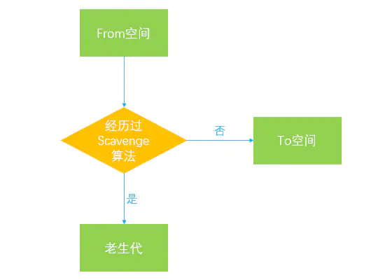

## 闭包
闭包是指那些能够访问自由变量的桉树。自由变量是指在函数中使用的，但既不是函数参数也不是函数的局部变量的变量。

## Hoisting变量提升
例如，从概念的字面意义上说，“变量提升”意味着变量和函数的声明会在物理层面移动到代码的最前面，但这么说并不准确。实际上变量和函数声明在代码里的位置是不会动的，而是在编译阶段被放入内存中。

## this的指向
- 全局上下文
this都指向全局对象
- 函数上下文
this的值默认指向全局对象
- 类上下文
在类的构造函数中，this 是一个常规对象。类中所有非静态的方法都会被添加到 this 的原型中：
- 作为对象的方法
当函数作为对象里的方法被调用时，this 被设置为调用该函数的对象。
- 构造函数调用
此时this指向实例对象
- 作为一个DOM事件处理函数
当函数被用作事件处理函数时，它的 this 指向触发事件的元素
```javascript
// 被调用时，将关联的元素变成蓝色
function bluify(e){
  console.log(this === e.currentTarget); // 总是 true

  // 当 currentTarget 和 target 是同一个对象时为 true
  console.log(this === e.target);
  this.style.backgroundColor = '#A5D9F3';
}

// 获取文档中的所有元素的列表
var elements = document.getElementsByTagName('*');

// 将bluify作为元素的点击监听函数，当元素被点击时，就会变成蓝色
for(var i=0 ; i<elements.length ; i++){
  elements[i].addEventListener('click', bluify, false);
}
```
- 作为一个内联时间处理函数
当代码被内联 on-event 处理函数 调用时，它的this指向监听器所在的DOM元素：
- 用apply, call或者bind来改变this的指向
this将永久地被绑定到了bind的第一个参数，无论这个函数是如何被调用的。
```javascript
function f(){
  return this.a;
}

var g = f.bind({a:"azerty"});
console.log(g()); // azerty

var h = g.bind({a:'yoo'}); // bind只生效一次！
console.log(h()); // azerty

var o = {a:37, f:f, g:g, h:h};
console.log(o.a, o.f(), o.g(), o.h()); // 37, 37, azerty, azerty
```

## 立即执行函数

## instanceof和typeof的实现原理
typeof 实现原理
typeof 一般被用于判断一个变量的类型，我们可以利用 typeof 来判断number, string, object, boolean, function, undefined, symbol 这七种类型，这种判断能帮助我们搞定一些问题。typeof 在判断一个 object的数据的时候只能告诉我们这个数据是 object, 而不能细致的具体到是哪一种 object。
其实，js 在底层存储变量的时候，会在变量的机器码的低位1-3位存储其类型信息👉

000：对象
010：浮点数
100：字符串
110：布尔
1：整数

之前我们提到了 instanceof 来判断对象的具体类型，其实 instanceof 主要的作用就是判断一个实例是否属于某种类型
其实 instanceof 主要的实现原理就是只要右边变量的 prototype 在左边变量的原型链上即可。因此，instanceof 在查找的过程中会遍历左边变量的原型链，直到找到右边变量的 prototype，如果查找失败，则会返回 false，告诉我们左边变量并非是右边变量的实例。

## apply, call和bind的区别
call 和 apply 的主要作用，是改变对象的执行上下文，并且是立即执行的。它们在参数上的写法略有区别。

bind 也能改变对象的执行上下文，它与 call 和 apply 不同的是，返回值是一个函数，并且需要稍后再调用一下，才会执行。

## bind 
```javascript
Function.prototype.bind2 = function (context) {

    var self = this;
    // 获取bind2函数从第二个参数到最后一个参数
    var args = Array.prototype.slice.call(arguments, 1);

    return function () {
        // 这个时候的arguments是指bind返回的函数传入的参数
        var bindArgs = Array.prototype.slice.call(arguments);
        return self.apply(context, args.concat(bindArgs));
    }

}
```

## new
new 运算符创建一个用户定义的对象类型的实例或具有构造函数的内置对象类型之一
访问到 Otaku 构造函数里的属性
访问到 Otaku.prototype 中的属性

## 柯里化
柯里化是一种将使用多个参数的一个函数转换成一系列使用一个参数的函数的技术。
```javascript
var curry = function (fn) {
    var args = [].slice.call(arguments, 1);
    return function() {
        var newArgs = args.concat([].slice.call(arguments));
        return fn.apply(this, newArgs);
    };
};

function progressCurrying(fn, args) {
    var _this = this
    var len = fn.length;
    var args = args || [];

    return function() {
        var _args = Array.prototype.slice.call(arguments);
        Array.prototype.push.apply(args, _args);

        // 如果参数个数小于最初的fn.length，则递归调用，继续收集参数
        if (_args.length < len) {
            return progressCurrying.call(_this, fn, _args);
        }

        // 参数收集完毕，则执行fn
        return fn.apply(this, _args);
    }
}
```

## V8垃圾回收机制
V8的垃圾回收策略主要是基于分代式垃圾回收机制，其根据对象的存活时间将内存的垃圾回收进行不同的分代，然后对不同的分代采用不同的垃圾回收算法。

### 新生代
在V8引擎的内存结构中，新生代主要用于存放存活时间较短的对象。新生代内存是由两个semispace(半空间)构成的，内存最大值在64位系统和32位系统上分别为32MB和16MB，在新生代的垃圾回收过程中主要采用了Scavenge算法。
Scavenge算法是一种典型的牺牲空间换取时间的算法，对于老生代内存来说，可能会存储大量对象，如果在老生代中使用这种算法，势必会造成内存资源的浪费，但是在新生代内存中，大部分对象的生命周期较短，在时间效率上表现可观，所以还是比较适合这种算法。

通过以上的流程图，我们可以很清楚地看到，Scavenge算法的垃圾回收过程主要就是将存活对象在From空间和To空间之间进行复制，同时完成两个空间之间的角色互换，因此该算法的缺点也比较明显，浪费了一半的内存用于复制。

### 对象晋升
当一个对象在经过多次复制之后依旧存活，那么它会被认为是一个生命周期较长的对象，在下一次进行垃圾回收时，该对象会被直接转移到老生代中，这种对象从新生代转移到老生代的过程我们称之为晋升。
对象晋升的条件主要有以下两个：
  对象是否经历过一次Scavenge算法
  To空间的内存占比是否已经超过25%
默认情况下，我们创建的对象都会分配在From空间中，当进行垃圾回收时，在将对象从From空间复制到To空间之前，会先检查该对象的内存地址来判断是否已经经历过一次Scavenge算法，如果地址已经发生变动则会将该对象转移到老生代中，不会再被复制到To空间，可以用以下的流程图来表示：

如果对象没有经历过Scavenge算法，会被复制到To空间，但是如果此时To空间的内存占比已经超过25%，则该对象依旧会被转移到老生代，如下图所示:

之所以有25%的内存限制是因为To空间在经历过一次Scavenge算法后会和From空间完成角色互换，会变为From空间，后续的内存分配都是在From空间中进行的，如果内存使用过高甚至溢出，则会影响后续对象的分配，因此超过这个限制之后对象会被直接转移到老生代来进行管理。

### 老生代
新的Mark-Sweep(标记清除)和Mark-Compact(标记整理)算法
Mark-Sweep(标记清除)分为标记和清除两个阶段，在标记阶段会遍历堆中的所有对象，然后标记活着的对象，在清除阶段中，会将死亡的对象进行清除。Mark-Sweep算法主要是通过判断某个对象是否可以被访问到，从而知道该对象是否应该被回收，具体步骤如下：

- 垃圾回收器会在内部构建一个根列表，用于从根节点出发去寻找那些可以被访问到的变量。比如在JavaScript中，window全局对象可以看成一个根节点。
- 然后，垃圾回收器从所有根节点出发，遍历其可以访问到的子节点，并将其标记为活动的，根节点不能到达的地方即为非活动的，将会被视为垃圾。
- 最后，垃圾回收器将会释放所有非活动的内存块，并将其归还给操作系统。

以下几种情况都可以作为根节点：
  1. 全局对象
  2. 本地函数的局部变量和参数
  3. 当前嵌套调用链上的其他函数的变量和参数

## 事件循环机制
js引擎遇到一个异步事件后并不会一直等待其返回结果，而是会将这个事件挂起，继续执行执行栈中的其他任务。当一个异步事件返回结果后，js会将这个事件加入与当前执行栈不同的另一个队列，我们称之为事件队列。被放入事件队列不会立刻执行其回调，而是等待当前执行栈中的所有任务都执行完毕， 主线程处于闲置状态时，主线程会去查找事件队列是否有任务。如果有，那么主线程会从中取出排在第一位的事件，并把这个事件对应的回调放入执行栈中，然后执行其中的同步代码...，如此反复，这样就形成了一个无限的循环。这就是这个过程被称为“事件循环（Event Loop）”的原因。
###　macro task与micro task
以上的事件循环过程是一个宏观的表述，实际上因为异步任务之间并不相同，因此他们的执行优先级也有区别。不同的异步任务被分为两类：微任务（micro task）和宏任务（macro task）。
以下事件属于宏任务：setInterval()，　setTimeout()
以下事件属于微任务：new Promise()
new MutaionObserver()

我们只需记住当当前执行栈执行完毕时会立刻先处理所有微任务队列中的事件，然后再去宏任务队列中取出一个事件。同一次事件循环中，微任务永远在宏任务之前执行。

### promise原理
Promise 必须为以下三种状态之一：等待态（Pending）、执行态（Fulfilled）和拒绝态（Rejected）。一旦Promise 被 resolve 或 reject，不能再迁移至其他任何状态（即状态 immutable）。

