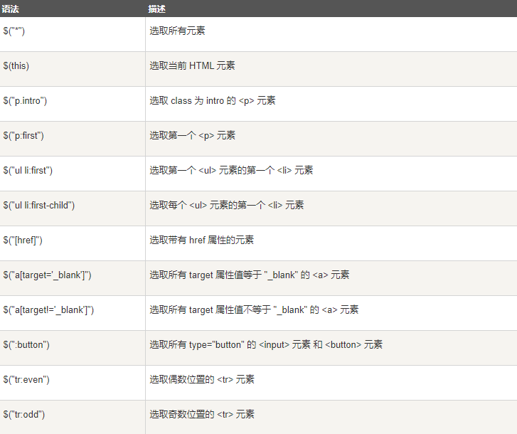

# 语法
基本的语法是<code>$(selector).action()</code>

比如：
<code>$(this).hide()</code> -隐藏当前元素

<code>$("p").hide()</code> -隐藏所有标签为p的元素

<code>$(".test").hide()</code> -隐藏所有class为test的元素

<code>$("#test").hide()</code> -隐藏所有id为test的元素

你可能经常看到jQuery的方程写成这样
```javascript
$(document).ready(function{
    //jQuery methods go here
})
```
主要是为了防止jQuery的代码在文件加载完之前就开始跑了。
也可以写成这样
```javascript
$(function(){
  // jQuery methods go here...
});
```
# 选择器
元素选择器
当用户点击任意一个button，所有p标签的元素都会消失
```javascript
$(document).ready(function(){
  $("button").click(function(){
    $("p").hide();
  });
});
```
id选择器
id为test的元素在按钮被按之后就会消失
```javascript
$(document).ready(function(){
  $("button").click(function(){
    $("#test").hide();
  });
});
```
class选择器
当用户点击任意一个button，所有class为test的元素都会消失
```javascript
$(document).ready(function(){
  $("button").click(function(){
    $(".test").hide();
  });
});
```
更多选择


# 事件
|鼠标事件|键盘事件|表单事件|文档/窗口事件|
|--|--|--|--|
|click 点击|keypress按下键盘|submit表单提交|load|
|dbclick|keydown|change|resize|
|mouseenter|keyup|focus|scroll|
|mouseleave||blur|unload|
|hover|

mouseenter当鼠标穿过时，会发生mouseenter事件
mouseleave当师表离开时，会发生mouseleave事件
mousedown当鼠标指针移动到元素上方，并按下鼠标按键时，会发生 mousedown 事件。
mouseup当在元素上松开鼠标按钮时，会发生 mouseup 事件。
hover鼠标悬停。当鼠标移动到元素上时，会触发指定的第一个函数(mouseenter);当鼠标移出这个元素时，会触发指定的第二个函数(mouseleave)。
```javascript
$("#p1").hover(
    function(){
        alert("你进入了 p1!");
    },
    function(){
        alert("拜拜! 现在你离开了 p1!");
    }
);
```
change改变输入框里的内容，然后点回车或者点击输入框外面。
focus点击表单的时候获取焦点
blur获取焦点后，失去焦点
load当指定的元素已加载时，会发生 load 事件。
resize改变浏览器窗口大小

# jQuery效果
## 隐藏、显示
语法
$(selector).hide(speed,callback);
$(selector).show(speed,callback)；
可选的 speed 参数规定隐藏/显示的速度，可以取以下值："slow"、"fast" 或毫秒。
可选的 callback 参数是隐藏或显示完成后所执行的函数名称。
```javascript
$(document).ready(function(){
  $(".hidebtn").click(function(){
    $("div").hide(1000,"linear",function(){
      alert("Hide() 方法已完成!");
    });
  });
});
```
通过 jQuery，您可以使用 toggle() 方法来切换 hide() 和 show() 方法。
```javascript
$("button").click(function(){
  $("p").toggle();
});
```
## 淡入淡出
- fadeIn()
  $(selector).fadeIn(speed,callback);
  ```javascript
  $("button").click(function(){
    $("#div1").fadeIn();
    $("#div2").fadeIn("slow");
    $("#div3").fadeIn(3000);
  });
  ```
- fadeOut()

- fadeToggle()

- fadeTo()
  jQuery fadeTo() 方法允许渐变为给定的不透明度（值介于 0 与 1 之间）。

## 效果-滑动
- slideDown()
  $(selector).slideDown(speed,callback);
```javascript
$("#flip").click(function(){
  $("#panel").slideDown();
});
```
- slideUp()
- slideToggle()

## 动画
语法：$(selector).animate({params},speed,callback);
```javascript
$(selector).animate({params},speed,callback);
```
操作多个属性
```javascript
$("button").click(function(){
  $("div").animate({
    left:'250px',
    opacity:'0.5',
    height:'150px',
    width:'150px'
  });
});
```
## 使用相对属性
```javascript
$("button").click(function(){
  $("div").animate({
    left:'250px',
    height:'+=150px',
    width:'+=150px'
  });
});
```
## 使用队列功能
```javascript
$("button").click(function(){
  var div=$("div");
  div.animate({height:'300px',opacity:'0.4'},"slow");
  div.animate({width:'300px',opacity:'0.8'},"slow");
  div.animate({height:'100px',opacity:'0.4'},"slow");
  div.animate({width:'100px',opacity:'0.8'},"slow");
});
```
## stop()方法
$(selector).stop(stopAll,goToEnd);
可选的 stopAll 参数规定是否应该清除动画队列。默认是 false，即仅停止活动的动画，允许任何排入队列的动画向后执行。
可选的 goToEnd 参数规定是否立即完成当前动画。默认是 false。
```javascript
$("#stop").click(function(){
  $("#panel").stop();
});
```
## callback方法
以下实例在隐藏效果完全实现后回调函数:
```javascript
$("button").click(function(){
  $("p").hide("slow",function(){
    alert("段落现在被隐藏了");
  });
});
```
以下实例没有回调函数，警告框会在隐藏效果完成前弹出：
```javascript
$("button").click(function(){
  $("p").hide(1000);
  alert("段落现在被隐藏了");
});
```
## 链
通过 jQuery，可以把动作/方法链接在一起。
Chaining 允许我们在一条语句中运行多个 jQuery 方法（在相同的元素上）
不过，有一种名为链接（chaining）的技术，允许我们在相同的元素上运行多条 jQuery 命令，一条接着另一条。
```javascript
$("#p1").css("color","red").slideUp(2000).slideDown(2000);

$("#p1").css("color","red")
  .slideUp(2000)
  .slideDown(2000);
```

