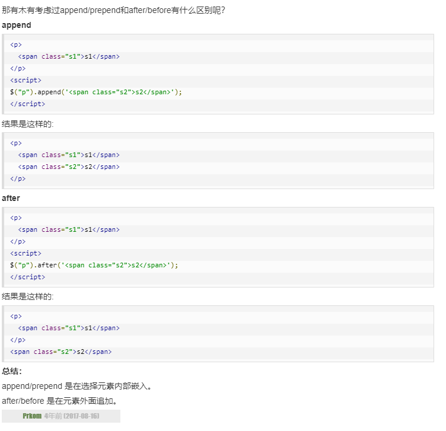

# 语法
基本的语法是<code>$(selector).action()</code>

比如：
<code>$(this).hide()</code> -隐藏当前元素

<code>$("p").hide()</code> -隐藏所有标签为p的元素

<code>$(".test").hide()</code> -隐藏所有class为test的元素

<code>$("#test").hide()</code> -隐藏所有id为test的元素

你可能经常看到jQuery的方程写成这样
```javascript
$(document).ready(function{
    //jQuery methods go here
})
```
主要是为了防止jQuery的代码在文件加载完之前就开始跑了。
也可以写成这样
```javascript
$(function(){
  // jQuery methods go here...
});
```
# 选择器
元素选择器
当用户点击任意一个button，所有p标签的元素都会消失
```javascript
$(document).ready(function(){
  $("button").click(function(){
    $("p").hide();
  });
});
```
id选择器
id为test的元素在按钮被按之后就会消失
```javascript
$(document).ready(function(){
  $("button").click(function(){
    $("#test").hide();
  });
});
```
class选择器
当用户点击任意一个button，所有class为test的元素都会消失
```javascript
$(document).ready(function(){
  $("button").click(function(){
    $(".test").hide();
  });
});
```
更多选择


# 事件
|鼠标事件|键盘事件|表单事件|文档/窗口事件|
|--|--|--|--|
|click 点击|keypress按下键盘|submit表单提交|load|
|dbclick|keydown|change|resize|
|mouseenter|keyup|focus|scroll|
|mouseleave||blur|unload|
|hover|

mouseenter当鼠标穿过时，会发生mouseenter事件
mouseleave当师表离开时，会发生mouseleave事件
mousedown当鼠标指针移动到元素上方，并按下鼠标按键时，会发生 mousedown 事件。
mouseup当在元素上松开鼠标按钮时，会发生 mouseup 事件。
hover鼠标悬停。当鼠标移动到元素上时，会触发指定的第一个函数(mouseenter);当鼠标移出这个元素时，会触发指定的第二个函数(mouseleave)。
```javascript
$("#p1").hover(
    function(){
        alert("你进入了 p1!");
    },
    function(){
        alert("拜拜! 现在你离开了 p1!");
    }
);
```
change改变输入框里的内容，然后点回车或者点击输入框外面。
focus点击表单的时候获取焦点
blur获取焦点后，失去焦点
load当指定的元素已加载时，会发生 load 事件。
resize改变浏览器窗口大小

# jQuery效果
## 隐藏、显示
语法
$(selector).hide(speed,callback);
$(selector).show(speed,callback)；
可选的 speed 参数规定隐藏/显示的速度，可以取以下值："slow"、"fast" 或毫秒。
可选的 callback 参数是隐藏或显示完成后所执行的函数名称。
```javascript
$(document).ready(function(){
  $(".hidebtn").click(function(){
    $("div").hide(1000,"linear",function(){
      alert("Hide() 方法已完成!");
    });
  });
});
```
通过 jQuery，您可以使用 toggle() 方法来切换 hide() 和 show() 方法。
```javascript
$("button").click(function(){
  $("p").toggle();
});
```
## 淡入淡出
- fadeIn()
  $(selector).fadeIn(speed,callback);
  ```javascript
  $("button").click(function(){
    $("#div1").fadeIn();
    $("#div2").fadeIn("slow");
    $("#div3").fadeIn(3000);
  });
  ```
- fadeOut()

- fadeToggle()

- fadeTo()
  jQuery fadeTo() 方法允许渐变为给定的不透明度（值介于 0 与 1 之间）。

## 效果-滑动
- slideDown()
  $(selector).slideDown(speed,callback);
```javascript
$("#flip").click(function(){
  $("#panel").slideDown();
});
```
- slideUp()
- slideToggle()

## 动画
语法：$(selector).animate({params},speed,callback);
```javascript
$(selector).animate({params},speed,callback);
```
操作多个属性
```javascript
$("button").click(function(){
  $("div").animate({
    left:'250px',
    opacity:'0.5',
    height:'150px',
    width:'150px'
  });
});
```
## 使用相对属性
```javascript
$("button").click(function(){
  $("div").animate({
    left:'250px',
    height:'+=150px',
    width:'+=150px'
  });
});
```
## 使用队列功能
```javascript
$("button").click(function(){
  var div=$("div");
  div.animate({height:'300px',opacity:'0.4'},"slow");
  div.animate({width:'300px',opacity:'0.8'},"slow");
  div.animate({height:'100px',opacity:'0.4'},"slow");
  div.animate({width:'100px',opacity:'0.8'},"slow");
});
```
## stop()方法
$(selector).stop(stopAll,goToEnd);
可选的 stopAll 参数规定是否应该清除动画队列。默认是 false，即仅停止活动的动画，允许任何排入队列的动画向后执行。
可选的 goToEnd 参数规定是否立即完成当前动画。默认是 false。
```javascript
$("#stop").click(function(){
  $("#panel").stop();
});
```
## callback方法
以下实例在隐藏效果完全实现后回调函数:
```javascript
$("button").click(function(){
  $("p").hide("slow",function(){
    alert("段落现在被隐藏了");
  });
});
```
以下实例没有回调函数，警告框会在隐藏效果完成前弹出：
```javascript
$("button").click(function(){
  $("p").hide(1000);
  alert("段落现在被隐藏了");
});
```
## 链
通过 jQuery，可以把动作/方法链接在一起。
Chaining 允许我们在一条语句中运行多个 jQuery 方法（在相同的元素上）
不过，有一种名为链接（chaining）的技术，允许我们在相同的元素上运行多条 jQuery 命令，一条接着另一条。
```javascript
$("#p1").css("color","red").slideUp(2000).slideDown(2000);

$("#p1").css("color","red")
  .slideUp(2000)
  .slideDown(2000);
```

# jQuery HTML

## jQuery 获取内容和属性
- text() - 设置或返回所选元素的文本内容
- html() - 设置或返回所选元素的内容（包括 HTML 标记）
  ```javascript
  $("#btn1").click(function(){
    alert("Text: " + $("#test").text());
  });
  $("#btn2").click(function(){
    alert("HTML: " + $("#test").html());
  });
  ```
- val() - 设置或返回表单字段的值
```javascript
$("#btn1").click(function(){
  alert("值为: " + $("#test").val());
});
```
__获取属性 - attr()__
```javascript
$("button").click(function(){
  alert($("#runoob").attr("href"));
});
```
## jQuery - 设置内容和属性
```javascript
$("#btn1").click(function(){
    $("#test1").text("Hello world!");
});
$("#btn2").click(function(){
    $("#test2").html("<b>Hello world!</b>");
});
$("#btn3").click(function(){
    $("#test3").val("RUNOOB");
});
```
text()、html() 以及 val() 的回调函数
```javascript
$("#btn1").click(function(){
    $("#test1").text(function(i,origText){
        return "旧文本: " + origText + " 新文本: Hello world! (index: " + i + ")"; 
    });
});
 
$("#btn2").click(function(){
    $("#test2").html(function(i,origText){
        return "旧 html: " + origText + " 新 html: Hello <b>world!</b> (index: " + i + ")"; 
    });
});
```
__设置属性 - attr()__

```javascript
$("button").click(function(){
  $("#runoob").attr("href","http://www.runoob.com/jquery");
});

/*attr() 方法也允许您同时设置多个属性。
下面的例子演示如何同时设置 href 和 title 属性：*/
$("button").click(function(){
    $("#runoob").attr({
        "href" : "http://www.runoob.com/jquery",
        "title" : "jQuery 教程"
    });
});

//回调函数
$("button").click(function(){
  $("#runoob").attr("href", function(i,origValue){
    return origValue + "/jquery"; 
  });
});
```
## 添加元素
- append() - 在被选元素的结尾插入内容
  ```javascript
    $("p").append("追加文本");
  ```
- prepend() - 在被选元素的开头插入内容
  ```javascript
  $("p").prepend("在开头追加文本");
  ```
通过 append() 和 prepend() 方法添加若干新元素
```javascript
function appendText(){
    var txt1="<p>文本-1。</p>";              // 使用 HTML 标签创建文本
    var txt2=$("<p></p>").text("文本-2。");  // 使用 jQuery 创建文本
    var txt3=document.createElement("p");
    txt3.innerHTML="文本-3。";               // 使用 DOM 创建文本 text with DOM
    $("body").append(txt1,txt2,txt3);        // 追加新元素
}
```

- after() - 在被选元素之后插入内容
- before() - 在被选元素之前插入内容

```javascript
$("img").after("在后面添加文本");
 
$("img").before("在前面添加文本");

function afterText()
{
    var txt1="<b>I </b>";                    // 使用 HTML 创建元素
    var txt2=$("<i></i>").text("love ");     // 使用 jQuery 创建元素
    var txt3=document.createElement("big");  // 使用 DOM 创建元素
    txt3.innerHTML="jQuery!";
    $("img").after(txt1,txt2,txt3);          // 在图片后添加文本
}
```
append/prepend和after/before的区别


## jQuery - 删除元素
```javascript
//jQuery remove() 方法删除被选元素及其子元素。
$("#div1").remove();
//jQuery empty() 方法删除被选元素的子元素。
$("#div1").empty();
//jQuery remove() 方法也可接受一个参数，允许您对被删元素进行过滤。
//该参数可以是任何 jQuery 选择器的语法。
$("p").remove(".italic");
```
## jQuery - 获取并设置 CSS 类
- addClass()
```javascript
$("button").click(function(){
  $("h1,h2,p").addClass("blue");
  $("div").addClass("important");
});
//您也可以在 addClass() 方法中规定多个类：
$("button").click(function(){
  $("body div:first").addClass("important blue");
});
```
- removeClass()
```javascript
$("button").click(function(){
  $("h1,h2,p").removeClass("blue");
});
```
- toggleClass()
```javascript
$("button").click(function(){
  $("h1,h2,p").toggleClass("blue");
});
```
## jQuery css() 方法
```javascript
//返回 CSS 属性
$("p").css("background-color");
//设置 CSS 属性
$("p").css("background-color","yellow");
//如需设置多个 CSS 属性，请使用如下语法：
$("p").css({"background-color":"yellow","font-size":"200%"});
```
## jQuery 尺寸
```javascript
//width() 方法设置或返回元素的宽度（不包括内边距、边框或外边距）。
//height() 方法设置或返回元素的高度（不包括内边距、边框或外边距）。
$("button").click(function(){
  var txt="";
  txt+="div 的宽度是: " + $("#div1").width() + "</br>";
  txt+="div 的高度是: " + $("#div1").height();
  $("#div1").html(txt);
});
//innerWidth() 方法返回元素的宽度（包括内边距）。
//innerHeight() 方法返回元素的高度（包括内边距）。
$("button").click(function(){
  var txt="";
  txt+="div 宽度，包含内边距: " + $("#div1").innerWidth() + "</br>";
    txt+="div 高度，包含内边距: " + $("#div1").innerHeight();
  $("#div1").html(txt);
});
//outerWidth() 方法返回元素的宽度（包括内边距和边框）。
//outerHeight() 方法返回元素的高度（包括内边距和边框）。
$("button").click(function(){
  var txt="";
  txt+="div 宽度，包含内边距和边框: " + $("#div1").outerWidth() + "</br>";
  txt+="div 高度，包含内边距和边框: " + $("#div1").outerHeight();
  $("#div1").html(txt);
});
```
# jQuery 遍历
## 祖先
- parent()
parent() 方法返回被选元素的直接父元素。
该方法只会向上一级对 DOM 树进行遍历。
  ```javascript
  $(document).ready(function(){
    $("span").parent();
  });
  ```
- parents()
  parents() 方法返回被选元素的所有祖先元素，它一路向上直到文档的根元素 (<html>)。
  ```javascript
  //下面的例子返回所有 <span> 元素的所有祖先：
  $(document).ready(function(){
    $("span").parents();
  });
  //下面的例子返回所有 <span> 元素的所有祖先，并且它是 <ul> 元素：
  $(document).ready(function(){
    $("span").parents("ul");
  });
  ```
- parentsUntil()
parentsUntil() 方法返回介于两个给定元素之间的所有祖先元素。
```javascript
$(document).ready(function(){
  $("span").parentsUntil("div");
});
```
## 后代
- children
  children() 方法返回被选元素的所有直接子元素。
```javascript
$(document).ready(function(){
  $("div").children();
});
//您也可以使用可选参数来过滤对子元素的搜索。
//下面的例子返回类名为 "1" 的所有 <p> 元素，并且它们是 <div> 的直接子元素：
$(document).ready(function(){
  $("div").children("p.1");
});
```
- find
find() 方法返回被选元素的后代元素，一路向下直到最后一个后代。
```javascript
//下面的例子返回属于 <div> 后代的所有 <span> 元素：
$(document).ready(function(){
  $("div").find("span");
});
//下面的例子返回 <div> 的所有后代：
$(document).ready(function(){
  $("div").find("*");
});
```
## 同胞
- siblings()
  ```javascript
  //siblings() 方法返回被选元素的所有同胞元素。
  $(document).ready(function(){
    $("h2").siblings();
  });
  //下面的例子返回属于 <h2> 的同胞元素的所有 <p> 元素：
  $(document).ready(function(){
    $("h2").siblings("p");
  });
  ```
- next()
next() 方法返回被选元素的下一个同胞元素。该方法只返回一个元素。
  ```javascript
  //下面的例子返回 <h2> 的下一个同胞元素：
  $(document).ready(function(){
    $("h2").next();
  });
  ```
- nextAll()
nextAll() 方法返回被选元素的所有跟随的同胞元素。
  ```javascript
  //下面的例子返回 <h2> 的所有跟随的同胞元素：
  $(document).ready(function(){
    $("h2").nextAll();
  });
  ```
- nextUntil()
nextUntil() 方法返回介于两个给定参数之间的所有跟随的同胞元素。
```javascript
//下面的例子返回介于 <h2> 与 <h6> 元素之间的所有同胞元素：
$(document).ready(function(){
  $("h2").nextUntil("h6");
});
```
- prev()
  prev(), prevAll() 以及 prevUntil() 方法的工作方式与上面的方法类似，只不过方向相反而已：它们返回的是前面的同胞元素（在 DOM 树中沿着同胞之前元素遍历，而不是之后元素遍历）。
- prevAll()
- prevUntil()
## 过滤
- first()
first() 方法返回被选元素的首个元素。
  ```javascript
  //下面的例子选取首个 <div> 元素内部的第一个 <p> 元素：
  $(document).ready(function(){
    $("div p").first();
  });
  ```
- last()
last() 方法返回被选元素的最后一个元素。
  ```javascript
  //下面的例子选择最后一个 <div> 元素中的最后一个 <p> 元素：
  $(document).ready(function(){
    $("div p").last();
  });
  ```
- eq()
eq() 方法返回被选元素中带有指定索引号的元素。
```javascript
//索引号从 0 开始，因此首个元素的索引号是 0 而不是 1。下面的例子选取第二个 <p> 元素（索引号 1）：
$(document).ready(function(){
  $("p").eq(1);
});
```
- filter()
filter() 方法允许您规定一个标准。不匹配这个标准的元素会被从集合中删除，匹配的元素会被返回。
```javascript
//下面的例子返回带有类名 "url" 的所有 <p> 元素：
$(document).ready(function(){
  $("p").filter(".url");
});
```
- not()
not() 方法返回不匹配标准的所有元素。
提示：not() 方法与 filter() 相反。
```javascript
//下面的例子返回不带有类名 "url" 的所有 <p> 元素：
$(document).ready(function(){
  $("p").not(".url");
});
```
