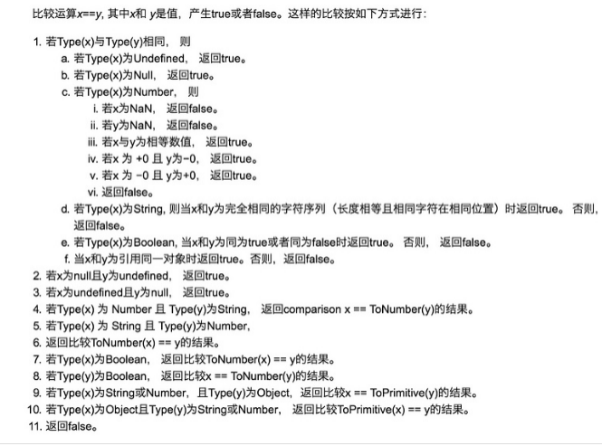

#HTTP/HTML/浏览器
- <b>说一下HTTP和HTTPS</b>

https的SSL加密是在传输层实现的。
1.  http和https的基本概念

http: 超文本传输协议，是互联网上应用最为广泛的一种网络协议，是一个客户端和服务器端请求和应答的标准（TCP），用于从WWW服务器传输超文本到本地浏览器的传输协议，它可以使浏览器更加高效，使网络传输减少。

https: 是以安全为目标的HTTP通道，简单讲是HTTP的安全版，即HTTP下加入SSL层，HTTPS的安全基础是SSL，因此加密的详细内容就需要SSL。

https协议的主要作用是：建立一个信息安全通道，来确保数组的传输，确保网站的真实性。

2. http和https的区别？

http传输的数据都是未加密的，也就是明文的，网景公司设置了SSL协议来对http协议传输的数据进行加密处理，简单来说https协议是由http和ssl协议构建的可进行加密传输和身份认证的网络协议，比http协议的安全性更高。
主要的区别如下：

Https协议需要ca证书，费用较高。

http是超文本传输协议，信息是明文传输，https则是具有安全性的ssl加密传输协议。

使用不同的链接方式，端口也不同，一般而言，http协议的端口为80，https的端口为443

http的连接很简单，是无状态的；HTTPS协议是由SSL+HTTP协议构建的可进行加密传输、身份认证的网络协议，比http协议安全。

3. https协议的工作原理

客户端在使用HTTPS方式与Web服务器通信时有以下几个步骤，如图所示。

客户使用https url访问服务器，则要求web 服务器建立ssl链接。

web服务器接收到客户端的请求之后，会将网站的证书（证书中包含了公钥），返回或者说传输给客户端。

客户端和web服务器端开始协商SSL链接的安全等级，也就是加密等级。

客户端浏览器通过双方协商一致的安全等级，建立会话密钥，然后通过网站的公钥来加密会话密钥，并传送给网站。

web服务器通过自己的私钥解密出会话密钥。

web服务器通过会话密钥加密与客户端之间的通信。

4. https协议的优点

使用HTTPS协议可认证用户和服务器，确保数据发送到正确的客户机和服务器；

HTTPS协议是由SSL+HTTP协议构建的可进行加密传输、身份认证的网络协议，要比http协议安全，可防止数据在传输过程中不被窃取、改变，确保数据的完整性。

HTTPS是现行架构下最安全的解决方案，虽然不是绝对安全，但它大幅增加了中间人攻击的成本。

谷歌曾在2014年8月份调整搜索引擎算法，并称“比起同等HTTP网站，采用HTTPS加密的网站在搜索结果中的排名将会更高”。

5. https协议的缺点

https握手阶段比较费时，会使页面加载时间延长50%，增加10%~20%的耗电。

https缓存不如http高效，会增加数据开销。

SSL证书也需要钱，功能越强大的证书费用越高。

SSL证书需要绑定IP，不能再同一个ip上绑定多个域名，ipv4资源支持不了这种消耗。

- __TCP和UDP的区别__

（1）TCP是面向连接的，udp是无连接的即发送数据前不需要先建立链接。
（2）TCP提供可靠的服务。也就是说，通过TCP连接传送的数据，无差错，不丢失，不重复，且按序到达;UDP尽最大努力交付，即不保证可靠交付。 并且因为tcp可靠，面向连接，不会丢失数据因此适合大数据量的交换。

（3）TCP是面向字节流，UDP面向报文，并且网络出现拥塞不会使得发送速率降低（因此会出现丢包，对实时的应用比如IP电话和视频会议等）。

（4）TCP只能是1对1的，UDP支持1对1,1对多。

（5）TCP的首部较大为20字节，而UDP只有8字节。

（6）TCP是面向连接的可靠性传输，而UDP是不可靠的。

- __WebSocket的实现和应用__

WebSocket是HTML5中的协议，支持持久连续。
WebSocket是基于Http协议的，或者说借用了Http协议来完成一部分握手，在握手阶段与Http是相同的。我们来看一个websocket握手协议的实现，基本是2个属性，upgrade，connection。

- __几个很实用的BOM属性对象方法?__

(1)location对象

location.href-- 返回或设置当前文档的URL
location.search -- 返回URL中的查询字符串部分。例如 http://www.dreamdu.com/dreamdu.php?id=5&name=dreamdu 返回包括(?)后面的内容?id=5&name=dreamdu
location.hash -- 返回URL#后面的内容，如果没有#，返回空
location.host -- 返回URL中的域名部分，例如www.dreamdu.com
location.hostname -- 返回URL中的主域名部分，例如dreamdu.com
location.pathname -- 返回URL的域名后的部分。例如 http://www.dreamdu.com/xhtml/ 返回/xhtml/
location.port -- 返回URL中的端口部分。例如 http://www.dreamdu.com:8080/xhtml/ 返回8080
location.protocol -- 返回URL中的协议部分。例如 http://www.dreamdu.com:8080/xhtml/ 返回(//)前面的内容http:
location.assign -- 设置当前文档的URL
location.replace() -- 设置当前文档的URL，并且在history对象的地址列表中移除这个URL location.replace(url);
location.reload() -- 重载当前页面

(2)history对象

history.go() -- 前进或后退指定的页面数 history.go(num);
history.back() -- 后退一页
history.forward() -- 前进一页

(3)Navigator对象

navigator.userAgent -- 返回用户代理头的字符串表示(就是包括浏览器版本信息等的字符串)
navigator.cookieEnabled -- 返回浏览器是否支持(启用)cookie

- __说一下HTML5 drag api__
dragstart：事件主体是被拖放元素，在开始拖放被拖放元素时触发，。
darg：事件主体是被拖放元素，在正在拖放被拖放元素时触发。

dragenter：事件主体是目标元素，在被拖放元素进入某元素时触发。

dragover：事件主体是目标元素，在被拖放在某元素内移动时触发。

dragleave：事件主体是目标元素，在被拖放元素移出目标元素是触发。

drop：事件主体是目标元素，在目标元素完全接受被拖放元素时触发。

dragend：事件主体是被拖放元素，在整个拖放操作结束时触发

- __说一下http2.0__

    - http2.0是基于1999年发布的http1.0之后的首次更新。
    - 提升访问速度（可以对于，请求资源所需时间更少，访问速度更快，相比http1.0）
    - 允许多路复用：多路复用允许同时通过单一的HTTP/2连接发送多重请求-响应信息。改善了：在http1.1中，浏览器客户端在同一时间，针对同一域名下的请求有一定数量限制（连接数量），超过限制会被阻塞。
    - 二进制分帧：HTTP2.0会将所有的传输信息分割为更小的信息或者帧，并对他们进行二进制编码
    - 首部压缩
    - 服务器端推送

- __fetch发送2次请求的原因__
fetch发送post请求的时候，总是发送2次，第一次状态码是204，第二次才成功？
原因很简单，因为你用fetch的post请求的时候，导致fetch 第一次发送了一个Options请求，询问服务器是否支持修改的请求头，如果服务器支持，则在第二次中发送真正的请求。

- __Cookie、sessionStorage、localStorage的区别__
共同点：都是保存在浏览器端，并且是同源的
Cookie：cookie数据始终在同源的http请求中携带（即使不需要），即cookie在浏览器和服务器间来回传递。而sessionStorage和localStorage不会自动把数据发给服务器，仅在本地保存。cookie数据还有路径（path）的概念，可以限制cookie只属于某个路径下,存储的大小很小只有4K左右。 （key：可以在浏览器和服务器端来回传递，存储容量小，只有大约4K左右）
sessionStorage：仅在当前浏览器窗口关闭前有效，自然也就不可能持久保持，localStorage：始终有效，窗口或浏览器关闭也一直保存，因此用作持久数据；cookie只在设置的cookie过期时间之前一直有效，即使窗口或浏览器关闭。（key：本身就是一个回话过程，关闭浏览器后消失，session为一个回话，当页面不同即使是同一页面打开两次，也被视为同一次回话）
localStorage：localStorage 在所有同源窗口中都是共享的；cookie也是在所有同源窗口中都是共享的。（key：同源窗口都会共享，并且不会失效，不管窗口或者浏览器关闭与否都会始终生效）
补充说明一下cookie的作用：
保存用户登录状态。例如将用户id存储于一个cookie内，这样当用户下次访问该页面时就不需要重新登录了，现在很多论坛和社区都提供这样的功能。 cookie还可以设置过期时间，当超过时间期限后，cookie就会自动消失。因此，系统往往可以提示用户保持登录状态的时间：常见选项有一个月、三个 月、一年等。
跟踪用户行为。例如一个天气预报网站，能够根据用户选择的地区显示当地的天气情况。如果每次都需要选择所在地是烦琐的，当利用了cookie后就会显得很人性化了，系统能够记住上一次访问的地区，当下次再打开该页面时，它就会自动显示上次用户所在地区的天气情况。因为一切都是在后 台完成，所以这样的页面就像为某个用户所定制的一样，使用起来非常方便定制页面。如果网站提供了换肤或更换布局的功能，那么可以使用cookie来记录用户的选项，例如：背景色、分辨率等。当用户下次访问时，仍然可以保存上一次访问的界面风格。

- __对HTML语义化标签的理解__
HTML5语义化标签是指正确的标签包含了正确的内容，结构良好，便于阅读，比如nav表示导航条，类似的还有article、header、footer等等标签。

- __iframe是什么？有什么缺点？__
定义：iframe元素会创建包含另一个文档的内联框架
提示：可以将提示文字放在\<iframe>\</iframe>之间，来提示某些不支持iframe的浏览器
缺点：
会阻塞主页面的onload事件
搜索引擎无法解读这种页面，不利于SEO
iframe和主页面共享连接池，而浏览器对相同区域有限制所以会影响性能。

- __Doctype作用?严格模式与混杂模式如何区分？它们有何意义?__
Doctype声明于文档最前面，告诉浏览器以何种方式来渲染页面，这里有两种模式，严格模式和混杂模式。
严格模式的排版和JS 运作模式是 以该浏览器支持的最高标准运行。
混杂模式，向后兼容，模拟老式浏览器，防止浏览器无法兼容页面。

- __Cookie和session的区别__
HTTP是一个无状态协议，因此Cookie的最大的作用就是存储sessionId用来唯一标识用户.
    1.    cookie数据存放在客户的浏览器上，session数据放在服务器上。
    2.    cookie不是很安全，别人可以分析存放在本地的COOKIE并进行COOKIE欺骗考虑到安全应当使用session。

    3.    session会在一定时间内保存在服务器上。当访问增多，会比较占用你服务器的性能考虑到减轻服务器性能方面，应当使用COOKIE。

    4.    单个cookie保存的数据不能超过4K，很多浏览器都限制一个站点最多保存20个cookie。

- __一句话概括RESTFUL__
就是用URL定位资源，用HTTP描述操作

- __addEventListener参数__
addEventListener(event, function, useCapture)
其中，event指定事件名；function指定要事件触发时执行的函数；useCapture指定事件是否在捕获或冒泡阶段执行。

- __介绍知道的http返回的状态码__

200    OK    请求成功。一般用于GET与POST请求
201    Created    已创建。成功请求并创建了新的资源
202    Accepted    已接受。已经接受请求，但未处理完成
203    Non-Authoritative Information    非授权信息。请求成功。但返回的meta信息不在原始的服务器，而是一个副本
204    No Content    无内容。服务器成功处理，但未返回内容。在未更新网页的情况下，可确保浏览器继续显示当前文档
205    Reset Content    重置内容。服务器处理成功，用户终端（例如：浏览器）应重置文档视图。可通过此返回码清除浏览器的表单域
206    Partial Content    部分内容。服务器成功处理了部分GET请求
300    Multiple Choices    多种选择。请求的资源可包括多个位置，相应可返回一个资源特征与地址的列表用于用户终端（例如：浏览器）选择
301    Moved Permanently    永久移动。请求的资源已被永久的移动到新URI，返回信息会包括新的URI，浏览器会自动定向到新URI。今后任何新的请求都应使用新的URI代替
302    Found    临时移动。与301类似。但资源只是临时被移动。客户端应继续使用原有URI
303    See Other    查看其它地址。与301类似。使用GET和POST请求查看
304    Not Modified    未修改。所请求的资源未修改，服务器返回此状态码时，不会返回任何资源。客户端通常会缓存访问过的资源，通过提供一个头信息指出客户端希望只返回在指定日期之后修改的资源
305    Use Proxy    使用代理。所请求的资源必须通过代理访问
306    Unused    已经被废弃的HTTP状态码
307    Temporary Redirect    临时重定向。与302类似。使用GET请求重定向
400    Bad Request    客户端请求的语法错误，服务器无法理解
401    Unauthorized    请求要求用户的身份认证
402    Payment Required    保留，将来使用
403    Forbidden    服务器理解请求客户端的请求，但是拒绝执行此请求
404    Not Found    服务器无法根据客户端的请求找到资源（网页）。通过此代码，网站设计人员可设置"您所请求的资源无法找到"的个性页面
500    Internal Server Error    服务器内部错误，无法完成请求
501    Not Implemented    服务器不支持请求的功能，无法完成请求
502    Bad Gateway    作为网关或者代理工作的服务器尝试执行请求时，从远程服务器接收到了一个无效的响应
503    Service Unavailable    由于超载或系统维护，服务器暂时的无法处理客户端的请求。延时的长度可包含在服务器的Retry-After头信息中
504    Gateway Time-out    充当网关或代理的服务器，未及时从远端服务器获取请求
505    HTTP Version not supported    服务器不支持请求的HTTP协议的版本，无法完成处理

- __http常用请求头__

- __强，协商缓存__
缓存分为两种：强缓存和协商缓存，根据响应的header内容来决定。
    ||获取资源形式|状态码|发送请求到服务器|
    |--|--|--|--|--|
    |强缓存|从缓存取|200(from cache)|否，直接从缓存取|
    |协商缓存| 从缓存取|304(not modified)是，通过服务器来告知缓存是否可用|
    强缓存相关字段有expires，cache-control。如果cache-control与expires同时存在的话，cache-control的优先级高于expires。
    协商缓存相关字段有Last-Modified/If-Modified-Since，Etag/If-None-Match

- __前端优化__
降低请求量：合并资源，减少HTTP 请求数，minify / gzip 压缩，webP，lazyLoad。
加快请求速度：预解析DNS，减少域名数，并行加载，CDN 分发。
缓存：HTTP 协议缓存请求，离线缓存 manifest，离线数据缓存localStorage。
渲染：JS/CSS优化，加载顺序，服务端渲染，pipeline。
- __GET和POST的区别__
get参数通过url传递，post放在request body中。
get请求在url中传递的参数是有长度限制的，而post没有。
get比post更不安全，因为参数直接暴露在url中，所以不能用来传递敏感信息。
get请求只能进行url编码，而post支持多种编码方式
get请求会浏览器主动cache，而post支持多种编码方式。
get请求参数会被完整保留在浏览历史记录里，而post中的参数不会被保留。
GET和POST本质上就是TCP链接，并无差别。但是由于HTTP的规定和浏览器/服务器的限制，导致他们在应用过程中体现出一些不同。
GET产生一个TCP数据包；POST产生两个TCP数据包。
- __HTTP支持的方法__
```
GET, POST, HEAD, OPTIONS, PUT, DELETE, TRACE, CONNECT
```
- __HTML5新增的元素__
首先html5为了更好的实践web语义化，增加了header，footer，nav,aside,section等语义化标签，在表单方面，为了增强表单，为input增加了color，emial,data ,range等类型，在存储方面，提供了sessionStorage，localStorage,和离线存储，通过这些存储方式方便数据在客户端的存储和获取，在多媒体方面规定了音频和视频元素audio和vedio，另外还有地理定位，canvas画布，拖放，多线程编程的web worker和websocket协议

- __在地址栏里输入一个URL,到这个页面呈现出来，中间会发生什么？__
输入url后，首先需要找到这个url域名的服务器ip,为了寻找这个ip，浏览器首先会寻找缓存，查看缓存中是否有记录，缓存的查找记录为：浏览器缓存-》系统缓存-》路由器缓存，缓存中没有则查找系统的hosts文件中是否有记录，如果没有则查询DNS服务器，得到服务器的ip地址后，浏览器根据这个ip以及相应的端口号，构造一个http请求，这个请求报文会包括这次请求的信息，主要是请求方法，请求说明和请求附带的数据，并将这个http请求封装在一个tcp包中，这个tcp包会依次经过传输层，网络层，数据链路层，物理层到达服务器，服务器解析这个请求来作出响应，返回相应的html给浏览器，因为html是一个树形结构，浏览器根据这个html来构建DOM树，在dom树的构建过程中如果遇到JS脚本和外部JS连接，则会停止构建DOM树来执行和下载相应的代码，这会造成阻塞，这就是为什么推荐JS代码应该放在html代码的后面，之后根据外部央视，内部央视，内联样式构建一个CSS对象模型树CSSOM树，构建完成后和DOM树合并为渲染树，这里主要做的是排除非视觉节点，比如script，meta标签和排除display为none的节点，之后进行布局，布局主要是确定各个元素的位置和尺寸，之后是渲染页面，因为html文件中会含有图片，视频，音频等资源，在解析DOM的过程中，遇到这些都会进行并行下载，浏览器对每个域的并行下载数量有一定的限制，一般是4-6个，当然在这些所有的请求中我们还需要关注的就是缓存，缓存一般通过Cache-Control、Last-Modify、Expires等首部字段控制。 Cache-Control和Expires的区别在于Cache-Control使用相对时间，Expires使用的是基于服务器 端的绝对时间，因为存在时差问题，一般采用Cache-Control，在请求这些有设置了缓存的数据时，会先 查看是否过期，如果没有过期则直接使用本地缓存，过期则请求并在服务器校验文件是否修改，如果上一次 响应设置了ETag值会在这次请求的时候作为If-None-Match的值交给服务器校验，如果一致，继续校验 Last-Modified，没有设置ETag则直接验证Last-Modified，再决定是否返回304
１.输入地址，发送至DNS服务器，获取相应的域名和web服务器的IP地址；
２.与web服务器建立TCP链接;
3.浏览器向web服务器发送HTTP请求;
4.服务器响应请求,并发送对应的数据;
5.浏览器下载数据,并解析源文件,渲染页面,呈现页面

- __常见的HTTP的头部__
可以将http首部分为通用首部，请求首部，响应首部，实体首部
通用首部表示一些通用信息，比如date表示报文创建时间，
请求首部就是请求报文中独有的，如cookie，和缓存相关的如if-Modified-Since
响应首部就是响应报文中独有的，如set-cookie，和重定向相关的location，
实体首部用来描述实体部分，如allow用来描述可执行的请求方法，content-type描述主题类型，content-Encoding描述主体的编码方式

- __cache-control的值有哪些__
cache-control是一个通用消息头字段被用于HTTP请求和响应中，通过指定指令来实现缓存机制，这个缓存指令是单向的，常见的取值有private、no-cache、max-age、must-revalidate等，默认为private。

- __浏览器在生成页面的时候，会生成那两颗树？__
构造两棵树，DOM树和CSSOM规则树
当浏览器接收到服务器相应来的HTML文档后，会遍历文档节点，生成DOM树.
CSSOM规则树由浏览器解析CSS文件生成.

- __怎么看网站的性能如何__
检测页面加载时间一般有两种方式，一种是被动去测：就是在被检测的页面置入脚本或探针，当用户访问网页时，探针自动采集数据并传回数据库进行分析，另一种主动监测的方式，即主动的搭建分布式受控环境，模拟用户发起页面访问请求，主动采集性能数据并分析.

- __介绍HTTP协议(特征)__
HTTP是一个基于TCP/IP通信协议来传递数据（HTML 文件, 图片文件, 查询结果等）HTTP是一个属于应用层的面向对象的协议，由于其简捷、快速的方式，适用于分布式超媒体信息系统。它于1990年提出，经过几年的使用与发展，得到不断地完善和扩展。目前在WWW中使用的是HTTP/1.0的第六版，HTTP/1.1的规范化工作正在进行之中，而且HTTP-NG(Next Generation of HTTP)的建议已经提出。HTTP协议工作于客户端-服务端架构为上。浏览器作为HTTP客户端通过URL向HTTP服务端即WEB服务器发送所有请求。Web服务器根据接收到的请求后，向客户端发送响应信息。

- __cookie有哪些字段可以设置__
name字段为一个cookie的名称。
value字段为一个cookie的值。
domain字段为可以访问此cookie的域名。
非顶级域名，如二级域名或者三级域名，设置的cookie的domain只能为顶级域名或者二级域名或者三级域名本身，不能设置其他二级域名的cookie，否则cookie无法生成。
顶级域名只能设置domain为顶级域名，不能设置为二级域名或者三级域名，否则cookie无法生成。
二级域名能读取设置了domain为顶级域名或者自身的cookie，不能读取其他二级域名domain的cookie。所以要想cookie在多个二级域名中共享，需要设置domain为顶级域名，这样就可以在所有二级域名里面或者到这个cookie的值了。
顶级域名只能获取到domain设置为顶级域名的cookie，其他domain设置为二级域名的无法获取。
path字段为可以访问此cookie的页面路径。 比如domain是abc.com,path是/test，那么只有/test路径下的页面可以读取此cookie。
expires/Max-Age 字段为此cookie超时时间。若设置其值为一个时间，那么当到达此时间后，此cookie失效。不设置的话默认值是Session，意思是cookie会和session一起失效。当浏览器关闭(不是浏览器标签页，而是整个浏览器) 后，此cookie失效。
Size字段 此cookie大小。
http字段  cookie的httponly属性。若此属性为true，则只有在http请求头中会带有此cookie的信息，而不能通过document.cookie来访问此cookie。
secure 字段 设置是否只能通过https来传递此条cookie

- __post和get的区别__
GET - 从指定的资源请求数据。
POST - 向指定的资源提交要被处理的数据。
GET：不同的浏览器和服务器不同，一般限制在2~8K之间，更加常见的是1k以内。
GET和POST的底层也是TCP/IP，GET/POST都是TCP链接。
GET产生一个TCP数据包；POST产生两个TCP数据包。
对于GET方式的请求，浏览器会把http header和data一并发送出去，服务器响应200（返回数据）；
而对于POST，浏览器先发送header，服务器响应100 continue，浏览器再发送data，服务器响应200 ok（返回数据）。

# CSS
- __CSS3新增的属性有哪些__
1. CSS3边框：
border-radius：CSS3圆角边框。在 CSS2 中添加圆角矩形需要技巧，我们必须为每个圆角使用不同的图片，在 CSS3 中，创建圆角是非常容易的，在 CSS3 中，border-radius 属性用于创建圆角。border：2px solid;
box-shadow：CSS3边框阴影。在 CSS3 中，box-shadow 用于向方框添加阴影。box-shadow:10px 10px 5px #888888;
border-image：CSS3边框图片。通过 CSS3 的 border-image 属性，您可以使用图片来创建边框。border-image：url(border.png) 30 30 round;

2. CSS3背景：
background-size： 属性规定背景图片的尺寸。在 CSS3 之前，背景图片的尺寸是由图片的实际尺寸决定的。在 CSS3 中，可以规定背景图片的尺寸，这就允许我们在不同的环境中重复使用背景图片。您能够以像素或百分比规定尺寸。如果以百分比规定尺寸，那么尺寸相对于父元素的宽度和高度。
background-origin ：属性规定背景图片的定位区域。背景图片可以放置于 content-box、padding-box 或 border-box 区域。

3. CSS3文字效果：
text-shadow：在 CSS3 中，text-shadow 可向文本应用阴影。text-shadow:5px 5px 5px #FFFFFF;
word-wrap :单词太长的话就可能无法超出某个区域，允许对长单词进行拆分，并换行到下一行：p{word-wrap:break-word;}

4. CSS3 2D转换：
transform：通过 CSS3 转换，我们能够对元素进行移动、缩放、转动、拉长或拉伸。
translate()：元素从其当前位置移动，根据给定的 left（x 坐标） 和 top（y 坐标） 位置参数：transform：translate（50px,100px）;值 translate(50px,100px) 把元素从左侧移动 50 像素，从顶端移动 100 像素。
rotate()：元素顺时针旋转给定的角度。允许负值，元素将逆时针旋转。transform:rotate(30deg);值 rotate(30deg) 把元素顺时针旋转 30 度。
scale():元素的尺寸会增加或减少，根据给定的宽度（X 轴）和高度（Y 轴）参数：transform:scale(2,4);值 scale(2,4) 把宽度转换为原始尺寸的 2 倍，把高度转换为原始高度的 4 倍。
skew():元素转动给定的角度，根据给定的水平线（X 轴）和垂直线（Y 轴）参数：transform:skew(30deg,20deg);值 skew(30deg,20deg) 围绕 X 轴把元素转动 30 度，围绕 Y 轴转动 20 度。
matrix() :
matrix() 方法把所有 2D 转换方法组合在一起。
matrix() 方法需要六个参数，包含数学函数，允许您：旋转、缩放、移动以及倾斜元素。

5. CSS3 3D转换：
rotateX()：元素围绕其 X 轴以给定的度数进行旋转。transform：rotateX(120deg);
rotateY()：元素围绕其 Y 轴以给定的度数进行旋转。transform：rotateY(120deg);
　　
6. CSS3 过渡：当元素从一种样式变换为另一种样式时为元素添加效果。

7. CSS3动画：通过 CSS3，我们能够创建动画，这可以在许多网页中取代动画图片、Flash 动画以及 JavaScript。

8. CSS3多列：
column-count：属性规定元素应该被分隔的列数。
column-gap：属性规定列之间的间隔。
column-rule ：属性设置列之间的宽度、样式和颜色规则。

9. CSS3用户界面：
resize：属性规定是否可由用户调整元素尺寸。
box-sizing：属性允许您以确切的方式定义适应某个区域的具体内容。
outline-offset ：属性对轮廓进行偏移，并在超出边框边缘的位置绘制轮廓。

- __说一下css盒模型__
就是用来装页面上的元素的矩形区域。CSS中的盒子模型包括IE盒子模型和标准的W3C盒子模型。
box-sizing(有3个值哦)：border-box,padding-box,content-box.
标准盒子模型：

IE盒子模型：

区别：从图中我们可以看出，这两种盒子模型最主要的区别就是width的包含范围，在标准的盒子模型中，width指content部分的宽度，在IE盒子模型中，width表示content+padding+border这三个部分的宽度，故这使得在计算整个盒子的宽度时存在着差异：
在CSS3中引入了box-sizing属性，box-sizing:content-box;表示标准的盒子模型，box-sizing:border-box表示的是IE盒子模型

- __link标签和import标签的区别__
link属于html标签，而@import是css提供的
页面被加载时，link会同时被加载，而@import引用的css会等到页面加载结束后加载。
link是html标签，因此没有兼容性，而@import只有IE5以上才能识别。
link方式样式的权重高于@import的。

- __transition和animation的区别__
Animation和transition大部分属性是相同的，他们都是随时间改变元素的属性值，他们的主要区别是transition需要触发一个事件才能改变属性，而animation不需要触发任何事件的情况下才会随时间改变属性值，并且transition为2帧，从from .... to，而animation可以一帧一帧的。

- __Flex布局__

    Flex是Flexible Box的缩写，意为"弹性布局"，用来为盒状模型提供最大的灵活性。
    布局的传统解决方案，基于盒状模型，依赖display属性 + position属性 + float属性。它对于那些特殊布局非常不方便，比如，垂直居中就不容易实现。

    简单的分为容器属性和元素属性
    容器的属性：
    ```css
    //决定主轴的方向（即子item的排列方法）    
    flex-direction：
    .box {
    flex-direction: row | row-reverse | column | column-reverse;
    }
    //决定换行规则
    flex-wrap：
    .box{
    flex-wrap: nowrap | wrap | wrap-reverse;
    }

    flex-flow：
    .box {
    flex-flow: <flex-direction> || <flex-wrap>;
    }

    justify-content：对其方式，水平主轴对齐方式

    align-items：对齐方式，竖直轴线方向
    ```
    项目属性
    order属性：定义项目的排列顺序，顺序越小，排列越靠前，默认为0

    flex-grow属性：定义项目的放大比例，即使存在空间，也不会放大

    flex-shrink属性：定义了项目的缩小比例，当空间不足的情况下会等比例的缩小，如果定义个item的flow-shrink为0，则为不缩小

    flex-basis属性：定义了在分配多余的空间，项目占据的空间。

    flex：是flex-grow和flex-shrink、flex-basis的简写，默认值为0 1 auto。

    align-self：允许单个项目与其他项目不一样的对齐方式，可以覆盖align-items，默认属性为auto，表示继承父元素的align-items

- __垂直居中的方法__
1. margin: auto
```css
div{
    width: 400px;
    height: 400px;
    position: relative;
    border: 1px solid #465468;
}
img{
    position: absolute;
    margin: auto;
    top: 0;
    left: 0;
    right: 0;
    bottom: 0;
}
```
```html
    <div>
    
    </div>
```
2. margin负值法
```css
.container{
width: 500px;
height: 400px;
border: 2px solid #379;
position: relative;
}
.inner{
width: 480px;
height: 380px;
background-color: #746;
position: absolute;
top: 50%;
left: 50%;
margin-top: -190px;
margin-left: -240px;
```
补充：其实这里也可以将marin-top和margin-left负值替换成，
transform：translateX(-50%)和transform：translateY(-50%)
3. table-cell 
设置父元素的display:table-cell,并且vertical-align:middle，这样子元素可以实现垂直居中。
```css
div{
width: 300px;
height: 300px;
border: 3px solid #555;
display: table-cell;
vertical-align: middle;
text-align: center;
}
img{
vertical-align: middle;
}
```
4. 利用flex
将父元素设置为display:flex，并且设置align-items:center;justify-content:center;
```css
.container{
width: 300px;
height: 200px;
border: 3px solid #546461;
display: -webkit-flex;
display: flex;
-webkit-align-items: center;
align-items: center;
-webkit-justify-content: center;
justify-content: center;
}
.inner{
border: 3px solid #458761;
padding: 20px;
}
```

- __关于js动画和css3动画的差异性__
渲染线程分为main thread和compositor thread，如果css动画只改变transform和opacity，这时整个CSS动画得以在compositor trhead完成（而js动画则会在main thread执行，然后出发compositor thread进行下一步操作），特别注意的是如果改变transform和opacity是不会layout或者paint的。
区别：
功能涵盖面，js比css大
实现/重构难度不一，CSS3比js更加简单，性能跳优方向固定
对帧速表现不好的低版本浏览器，css3可以做到自然降级
css动画有天然事件支持
css3有兼容性问题

- __说一下块元素和行元素__
块元素：独占一行，并且有自动填满父元素，可以设置margin和pading以及高度和宽度
行元素：不会独占一行，width和height会失效，并且在垂直方向的padding和margin会失
效。

- __元素隐藏__
opacity=0，该元素隐藏起来了，但不会改变页面布局，并且，如果该元素已经绑定一些事件，如click事件，那么点击该区域，也能触发点击事件的
visibility=hidden，该元素隐藏起来了，但不会改变页面布局，但是不会触发该元素已经绑定的事件
display=none，把元素隐藏起来，并且会改变页面布局，可以理解成在页面中把该元素删除掉一样。

- __position属性 比较__
    固定定位fixed：
    元素的位置相对于浏览器窗口是固定位置，即使窗口是滚动的它也不会移动。Fixed定位使元素的位置与文档流无关，因此不占据空间。 Fixed定位的元素和其他元素重叠。

    相对定位relative：
    如果对一个元素进行相对定位，它将出现在它所在的位置上。然后，可以通过设置垂直或水平位置，让这个元素“相对于”它的起点进行移动。 在使用相对定位时，无论是否进行移动，元素仍然占据原来的空间。因此，移动元素会导致它覆盖其它框。

    绝对定位absolute：
    绝对定位的元素的位置相对于最近的已定位父元素，如果元素没有已定位的父元素，那么它的位置相对于<html>。 absolute 定位使元素的位置与文档流无关，因此不占据空间。 absolute 定位的元素和其他元素重叠。

    粘性定位sticky：
    元素先按照普通文档流定位，然后相对于该元素在流中的flow root（BFC）和 containing block（最近的块级祖先元素）定位。而后，元素定位表现为在跨越特定阈值前为相对定位，之后为固定定位。

    默认定位Static：
    默认值。没有定位，元素出现在正常的流中（忽略top, bottom, left, right 或者 z-index 声明）。

    inherit:
    规定应该从父元素继承position 属性的值。


- __浮动清除__
    方法一：使用带clear属性的空元素
    在浮动元素后使用一个空元素如\<div class="clear">\</div>，并在CSS中赋予.clear{clear:both;}属性即可清理浮动。亦可使用\<br class="clear" />或\<hr class="clear" />来进行清理。

    方法二：使用CSS的overflow属性
    给浮动元素的容器添加overflow:hidden;或overflow:auto;可以清除浮动，另外在 IE6 中还需要触发 hasLayout ，例如为父元素设置容器宽高或设置 zoom:1。

    在添加overflow属性后，浮动元素又回到了容器层，把容器高度撑起，达到了清理浮动的效果。

    方法三：给浮动的元素的容器添加浮动
    给浮动元素的容器也添加上浮动属性即可清除内部浮动，但是这样会使其整体浮动，影响布局，不推荐使用。

    方法四：使用邻接元素处理
    什么都不做，给浮动元素后面的元素添加clear属性。

    方法五：使用CSS的:after伪元素
    结合:after 伪元素（注意这不是伪类，而是伪元素，代表一个元素之后最近的元素）和 IEhack ，可以完美兼容当前主流的各大浏览器，这里的 IEhack 指的是触发 hasLayout。

    给浮动元素的容器添加一个clearfix的class，然后给这个class添加一个:after伪元素实现元素末尾添加一个看不见的块元素（Block element）清理浮动。

- __CSS选择器__
    id 选择器，class 选择器，标签选择器，伪元素选择器，伪类选择器等
    同一元素引用了多个样式时，排在后面的样式属性的优先级高；

    样式选择器的类型不同时，优先级顺序为：id 选择器 > class 选择器 > 标签选择器；

    标签之间存在层级包含关系时，后代元素会继承祖先元素的样式。如果后代元素定义了与祖先元素相同的样式，则祖先元素的相同的样式属性会被覆盖。继承的样式的优先级比较低，至少比标签选择器的优先级低；

    带有!important 标记的样式属性的优先级最高；

    样式表的来源不同时，优先级顺序为：内联样式> 内部样式 > 外部样式 > 浏览器用户自定义样式 > 浏览器默认样式

-  __如何实现元素的垂直居中__
    法一：父元素display:flex,align-items:center;
    法二：元素绝对定位，top:50%，margin-top：-（高度/2）

    法三：高度不确定用transform：translateY（-50%）

    法四：父元素table布局，子元素设置vertical-align:center;

- __CSS3中对溢出的处理__
text-overflow属性，值为clip是修剪文本；ellipsis为显示省略符号来表被修剪的文本；string为使用给定的字符串来代表被修剪的文本。

- __float的元素，display是什么__
display为block

- __display：table和本身的table有什么区别__
Display:table和本身table是相对应的，区别在于，display：table的css声明能够让一个html元素和它的子节点像table元素一样，使用基于表格的css布局，是我们能够轻松定义一个单元格的边界，背景等样式，而不会产生因为使用了table那样的制表标签导致的语义化问题。

- __z-index的定位方法__
z-index属性设置元素的堆叠顺序，拥有更好堆叠顺序的元素会处于较低顺序元素之前，z-index可以为负，且z-index只能在定位元素上奏效，该属性设置一个定位元素沿z轴的位置，如果为正数，离用户越近，为负数，离用户越远，它的属性值有auto，默认，堆叠顺序与父元素相等，number，inherit，从父元素继承z-index属性的值

- __如果想要改变一个DOM元素的字体颜色，不在它本身上进行操作？__
可以更改父元素的color

- __line-height和height的区别__
line-height一般是指布局里面一段文字上下行之间的高度，是针对字体来设置的，height一般是指容器的整体高度，

- __设置一个元素的背景颜色，背景颜色会填充哪些区域？__
background-color设置的背景颜色会填充元素的content、padding、border区域

- __inline-block、inline和block的区别；为什么img是inline还可以设置宽高__

    Block是块级元素，其前后都会有换行符，能设置宽度，高度，margin/padding水平垂直方向都有效。
    Inline：设置width和height无效，margin在竖直方向上无效，padding在水平方向垂直方向都有效，前后无换行符

    Inline-block：能设置宽度高度，margin/padding水平垂直方向 都有效，前后无换行符

- __CSS画正方体，三角形__
画三角形
```css
#triangle02{
width: 0;
height: 0;
border-top: 50px solid blue;
border-right: 50px solid red;
border-bottom: 50px solid green;
border-left: 50px solid yellow;
}
```
画正方体：
```html
<!DOCTYPE html>
<html lang="en">
<head>
<meta charset="UTF-8">
<title>perspective</title>
<style>
.wrapper{
width: 50%;
float: left;
}
.cube{
font-size: 4em;
width: 2em;
margin: 1.5em auto;
transform-style:preserve-3d;
transform:rotateX(-35deg) rotateY(30deg);
}
.side{
position: absolute;
width: 2em;
height: 2em;
background: rgba(255,99,71,0.6);
border: 1px solid rgba(0,0,0,0.5);
color: white;
text-align: center;
line-height: 2em;
}
.front{
transform:translateZ(1em);
}
.bottom{
transform:rotateX(-90deg) translateZ(1em);
}
.top{
transform:rotateX(90deg) translateZ(1em);
}
.left{
transform:rotateY(-90deg) translateZ(1em);
}
.right{
transform:rotateY(90deg) translateZ(1em);
}
.back{
transform:translateZ(-1em);
}
</style>
</head>
<body>
<div class="wrapper w1">
<div class="cube">
<div class="side front">1</div>
<div class="side back">6</div>
<div class="side right">4</div>
<div class="side left">3</div>
<div class="side top">5</div>
<div class="side bottom">2</div>
</div>
</div>
<div class="wrapper w2">
<div class="cube">
<div class="side front">1</div>
<div class="side back">6</div>
<div class="side right">4</div>
<div class="side left">3</div>
<div class="side top">5</div>
<div class="side bottom">2</div>
</div>
</div>
</body>
</html>
```

- __两个嵌套的div，position都是absolute，子div设置top属性，那么这个top是相对于父元素的哪个位置定位的。__
margin的外边缘

# Javascript
- __get请求传参长度的误区__
    误区：我们经常说get请求参数的大小存在限制，而post请求的参数大小是无限制的。
    实际上HTTP 协议从未规定 GET/POST 的请求长度限制是多少。对get请求参数的限制是来源与浏览器或web服务器，浏览器或web服务器限制了url的长度。为了明确这个概念，我们必须再次强调下面几点:

    HTTP 协议 未规定 GET 和POST的长度限制

    GET的最大长度显示是因为 浏览器和 web服务器限制了 URI的长度

    不同的浏览器和WEB服务器，限制的最大长度不一样

    要支持IE，则最大长度为2083byte，若只支持Chrome，则最大长度 8182byte
- __说一下闭包__
闭包就是能够读取其他函数内部变量的函数，或者子函数在外调用，子函数所在的父函数的作用域不会被释放。
- __说一下类的创建和继承__
ES6
```javascript
class Person {
    constructor(name){
        console.log(`构造函数执行了,${name}`)
        this.name=name
    }
    showName(){
        return `名字为${this.name}`
    }
}
let p1= new Person('jona')
console.log(p1.showName)

// 子类
class children  extends Person{
    constructor(agrs){
        super(ags) 
    }
 
 showName (){
        super.showName()//调用父级的方法也是用super
    }
}
let p2 = new children('子类')
```
- __如何解决异步回调地狱__
promise、generator、async/await

- __说说前端中的事件流__
事件流描述的是从页面中接收事件的顺序,DOM2级事件流包括下面几个阶段。
事件捕获阶段

    处于目标阶段

    事件冒泡阶段
    addEventListener：addEventListener 是DOM2 级事件新增的指定事件处理程序的操作，这个方法接收3个参数：要处理的事件名、作为事件处理程序的函数和一个布尔值。最后这个布尔值参数如果是true，表示在捕获阶段调用事件处理程序；如果是false，表示在冒泡阶段调用事件处理程序。
    IE只支持事件冒泡。

- __说一下事件委托__
简介：事件委托指的是，不在事件的发生地（直接dom）上设置监听函数，而是在其父元素上设置监听函数，通过事件冒泡，父元素可以监听到子元素上事件的触发，通过判断事件发生元素DOM的类型，来做出不同的响应。
举例：最经典的就是ul和li标签的事件监听，比如我们在添加事件时候，采用事件委托机制，不会在li标签上直接添加，而是在ul父元素上添加。

    好处：比较合适动态元素的绑定，新添加的子元素也会有监听函数，也可以有事件触发机制。

- __说一下图片的懒加载和预加载__
预加载：提前加载图片，当用户需要查看时可直接从本地缓存中渲染。
懒加载：懒加载的主要目的是作为服务器前端的优化，减少请求数或延迟请求数。


    两种技术的本质：两者的行为是相反的，一个是提前加载，一个是迟缓甚至不加载。
    懒加载对服务器前端有一定的缓解压力作用，预加载则会增加服务器前端压力。

- __mouseover和mouseenter的区别__
mouseover：当鼠标移入元素或其子元素都会触发事件，所以有一个重复触发，冒泡的过程。对应的移除事件是mouseout
mouseenter：当鼠标移除元素本身（不包含元素的子元素）会触发事件，也就是不会冒泡，对应的移除事件是mouseleave

- __js的new操作符做了哪些事情__
new 操作符新建了一个空对象，这个对象原型指向构造函数的prototype，执行构造函数后返回这个对象。

- __改变函数内部this指针的指向函数（bind，apply，call的区别）__
通过apply和call改变函数的this指向，他们两个函数的第一个参数都是一样的表示要改变指向的那个对象，第二个参数，apply是数组，而call则是arg1,arg2...这种形式。通过bind改变this作用域会返回一个新的函数，这个函数不会马上执行。

- __js的各种位置，比如clientHeight,scrollHeight,offsetHeight ,以及scrollTop, offsetTop,clientTop的区别？__
clientHeight：表示的是可视区域的高度，不包含border和滚动条
    offsetHeight：表示可视区域的高度，包含了border和滚动条

    scrollHeight：表示了所有区域的高度，包含了因为滚动被隐藏的部分。

    clientTop：表示边框border的厚度，在未指定的情况下一般为0

    scrollTop：滚动后被隐藏的高度，获取对象相对于由offsetParent属性指定的父坐标(css定位的元素或body元素)距离顶端的高度。

- __js拖拽功能的实现__
可以通过html5的拖放（Drag 和 drop）来实现

- __异步加载js的方法__
    方法一：\<script>标签的async="async"属性
    - async属性是HTML5新增属性，需要Chrome、FireFox、IE9+浏览器支持

    - async属性规定一旦脚本可用，则会异步执行

    - async属性仅适用于外部脚本

    - 此方法不能保证脚本按顺序执行

    - 他们将在onload事件之前完成
    方法二：\<script>标签的defer="defer"属性
    defer属性规定是否对脚本执行进行延迟，直到页面加载为止

    如果脚本不会改变文档的内容，可将defer属性加入到\<script>标签中，以便加快处理文档的速度

    兼容所有浏览器

    此方法可以确保所有设置了defer属性的脚本按顺序执行

- __Ajax解决浏览器缓存问题__
在ajax发送请求前加上 anyAjaxObj.setRequestHeader("If-Modified-Since","0")。

    在ajax发送请求前加上 anyAjaxObj.setRequestHeader("Cache-Control","no-cache")。

    在URL后面加上一个随机数： "fresh=" + Math.random()。

    在URL后面加上时间搓："nowtime=" + new Date().getTime()。

    如果是使用jQuery，直接这样就可以了 $.ajaxSetup({cache:false})。这样页面的所有ajax都会执行这条语句就是不需要保存缓存记录。

- __eval是做什么的__
它的功能是将对应的字符串解析成js并执行，应该避免使用js，因为非常消耗性能（2次，一次解析成js，一次执行）

- __如何理解前端模块化__
前端模块化就是复杂的文件编程一个一个独立的模块，比如js文件等等，分成独立的模块有利于重用（复用性）和维护（版本迭代），这样会引来模块之间相互依赖的问题，所以有了commonJS规范，AMD，CMD规范等等，以及用于js打包（编译等处理）的工具webpack.

- __对象深度克隆的简单实现__
```javascript
function deepClone(obj){
    var newObj= obj instanceof Array ? []:{};
    for(var item in obj){
        var temple= typeof obj[item] == 'object' ? deepClone(obj[item]):obj[item];
        newObj[item] = temple;
    }
    return newObj;
}
```
这种方法无法实现对于包装对象Number，String，Boolean以及正则对象RegExp和Date对象的克隆
对于原始值或者包装类我们使用valueOf方法
```javascript
function baseClone(base){
    return base.valueOf();
}
```
- __将原生的ajax封装成promise__
```javascript
var  myNewAjax=function(url){
    return new Promise(function(resolve,reject){
        var xhr = new XMLHttpRequest();
        xhr.open('get',url);
        xhr.send(data);
        xhr.onreadystatechange=function(){
            if(xhr.status==200&&readyState==4){
                var json=JSON.parse(xhr.responseText);
                resolve(json)
            }else if(xhr.readyState==4&&xhr.    status!=200){
                reject('error');
            }
        }
    })
}
```

- __\==和\===、以及Object.is的区别__
\==：等同，比较运算符，两边值类型不同的时候，先进行类型转换，再比较；
\===：恒等，严格比较运算符，不做类型转换，类型不同就是不等；
Object.is()是ES6新增的用来比较两个值是否严格相等的方法，与\===的行为基本一致,不过有两处不同：
    - +0不等于-0。
    - NaN等于自身。

- __js类型判断__
判断方法：typeof()，instanceof，Object.prototype.toString.call()等

- __数组去重__
法一：indexOf循环去重
法二：ES6 Set去重；Array.from(new Set(array))

    法三：Object 键值对去重；把数组的值存成 Object 的 key 值，比如 Object[value1] = true，在判断另一个值的时候，如果 Object[value2]存在的话，就说明该值是重复的。

- __闭包 有什么用__
（1）什么是闭包：
闭包是指有权访问另外一个函数作用域中的变量的函数。

    闭包就是函数的局部变量集合，只是这些局部变量在函数返回后会继续存在。闭包就是就是函数的“堆栈”在函数返回后并不释放，我们也可以理解为这些函数堆栈并不在栈上分配而是在堆上分配。当在一个函数内定义另外一个函数就会产生闭包。

    （2）为什么要用：

    匿名自执行函数：我们知道所有的变量，如果不加上var关键字，则默认的会添加到全局对象的属性上去，这样的临时变量加入全局对象有很多坏处，比如：别的函数可能误用这些变量；造成全局对象过于庞大，影响访问速度(因为变量的取值是需要从原型链上遍历的)。除了每次使用变量都是用var关键字外，我们在实际情况下经常遇到这样一种情况，即有的函数只需要执行一次，其内部变量无需维护，可以用闭包。

    结果缓存：我们开发中会碰到很多情况，设想我们有一个处理过程很耗时的函数对象，每次调用都会花费很长时间，那么我们就需要将计算出来的值存储起来，当调用这个函数的时候，首先在缓存中查找，如果找不到，则进行计算，然后更新缓存并返回值，如果找到了，直接返回查找到的值即可。闭包正是可以做到这一点，因为它不会释放外部的引用，从而函数内部的值可以得以保留。

    封装：实现类和继承等。

- __去除字符串首尾空格__
```javascript
String.prototype.Trim = function()  
{  
    return this.replace(/(^\s*)|(\s*$)/g, "");  
}
//or 
function trim(s){
    return s.replace(/(^\s*)|(\s*$)/g, "");
}
```

- __能来讲讲JS的语言特性吗__
运行在客户端浏览器上；
不用预编译，直接解析执行代码；

    是弱类型语言，较为灵活；

    与操作系统无关，跨平台的语言；

    脚本语言、解释性语言

- __重排和重绘__
重绘（repaint或redraw）：当盒子的位置、大小以及其他属性，例如颜色、字体大小等都确定下来之后，浏览器便把这些原色都按照各自的特性绘制一遍，将内容呈现在页面上。重绘是指一个元素外观的改变所触发的浏览器行为，浏览器会根据元素的新属性重新绘制，使元素呈现新的外观。
触发重绘的条件：改变元素外观属性。如：color，background-color等。

    注意：table及其内部元素可能需要多次计算才能确定好其在渲染树中节点的属性值，比同等元素要多花两倍时间，这就是我们尽量避免使用table布局页面的原因之一。

    重排（重构/回流/reflow）：当渲染树中的一部分(或全部)因为元素的规模尺寸，布局，隐藏等改变而需要重新构建, 这就称为回流(reflow)。每个页面至少需要一次回流，就是在页面第一次加载的时候。

    重绘和重排的关系：在回流的时候，浏览器会使渲染树中受到影响的部分失效，并重新构造这部分渲染树，完成回流后，浏览器会重新绘制受影响的部分到屏幕中，该过程称为重绘。所以，重排必定会引发重绘，但重绘不一定会引发重排。

- __跨域的原理__
跨域，是指浏览器不能执行其他网站的脚本。它是由浏览器的同源策略造成的，是浏览器对JavaScript实施的安全限制，那么只要协议、域名、端口有任何一个不同，都被当作是不同的域。跨域原理，即是通过各种方式，避开浏览器的安全限制。

- __不同数据类型的值的比较，是怎么转换的，有什么规则__


- __this的指向 哪几种__
默认绑定：全局环境中，this默认绑定到window。
隐式绑定：一般地，被直接对象所包含的函数调用时，也称为方法调用，this隐式绑定到该直接对象。

    隐式丢失：隐式丢失是指被隐式绑定的函数丢失绑定对象，从而默认绑定到window。显式绑定：通过call()、apply()、bind()方法把对象绑定到this上，叫做显式绑定。

    new绑定：如果函数或者方法调用之前带有关键字new，它就构成构造函数调用。对于this绑定来说，称为new绑定。

    【1】构造函数通常不使用return关键字，它们通常初始化新对象，当构造函数的函数体执行完毕时，它会显式返回。在这种情况下，构造函数调用表达式的计算结果就是这个新对象的值。

    【2】如果构造函数使用return语句但没有指定返回值，或者返回一个原始值，那么这时将忽略返回值，同时使用这个新对象作为调用结果。

    【3】如果构造函数显式地使用return语句返回一个对象，那么调用表达式的值就是这个对象。

- __什么是按需加载__
当用户触发了动作时才加载对应的功能。触发的动作，是要看具体的业务场景而言，包括但不限于以下几个情况：鼠标点击、输入文字、拉动滚动条，鼠标移动、窗口大小更改等。加载的文件，可以是JS、图片、CSS、HTML等。

- __说一下什么是virtual dom__
用JavaScript 对象结构表示 DOM 树的结构；然后用这个树构建一个真正的 DOM 树，插到文档当中 当状态变更的时候，重新构造一棵新的对象树。然后用新的树和旧的树进行比较，记录两棵树差异 把所记录的差异应用到所构建的真正的DOM树上，视图就更新了。Virtual DOM 本质上就是在 JS 和 DOM 之间做了一个缓存。

- __webpack用来干什么的__
webpack 是一个现代 JavaScript 应用程序的静态模块打包器(module bundler)。当 webpack 处理应用程序时，它会递归地构建一个依赖关系图(dependency graph)，其中包含应用程序需要的每个模块，然后将所有这些模块打包成一个或多个bundle。

- __JS中继承实现的几种方式__
1、原型链继承，将父类的实例作为子类的原型，他的特点是实例是子类的实例也是父类的实例，父类新增的原型方法/属性，子类都能够访问，并且原型链继承简单易于实现，缺点是来自原型对象的所有属性被所有实例共享，无法实现多继承，无法向父类构造函数传参。
2、构造继承，使用父类的构造函数来增强子类实例，即复制父类的实例属性给子类，

构造继承可以向父类传递参数，可以实现多继承，通过call多个父类对象。但是构造继承只能继承父类的实例属性和方法，不能继承原型属性和方法，无法实现函数服用，每个子类都有父类实例函数的副本，影响性能

3、实例继承，为父类实例添加新特性，作为子类实例返回，实例继承的特点是不限制调用方法，不管是new 子类（）还是子类（）返回的对象具有相同的效果，缺点是实例是父类的实例，不是子类的实例，不支持多继承

4、拷贝继承：特点：支持多继承，缺点：效率较低，内存占用高（因为要拷贝父类的属性）无法获取父类不可枚举的方法（不可枚举方法，不能使用for in 访问到）

5、组合继承：通过调用父类构造，继承父类的属性并保留传参的优点，然后通过将父类实例作为子类原型，实现函数复用

6、寄生组合继承：通过寄生方式，砍掉父类的实例属性，这样，在调用两次父类的构造的时候，就不会初始化两次实例方法/属性，避免的组合继承的缺点

- __写一个函数，第一秒打印1，第二秒打印2__
```javascript
for(let i=0;i<5;i++){
    setTimeout(function(){
        console.log(i)
    },1000*i)
}
```