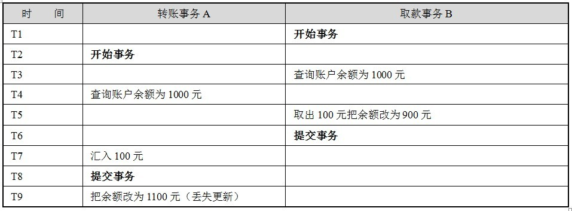

# 事务

## 1. 什么是事务
    数据库事务是构成单一逻辑工作单元的操作集合。
## 2. 事务的ACID特性以及实现原理
- 原子性（Atomicity）:事务中的所有操作作为一个整体向原子一样不可分割，要么全部成功，要么全部失败。
- 一致性（Consistency）:事务的执行结果必须是数据库从一个一致性状态到另一个一致性状态。
一致性状态是指：数据库中的数据应该满足完整性约束，符合数据库本应该描述的现实世界的真实状态。
- 隔离性（Isolcation）:并行执行的事务不会互相影响。
- 持久性(Durability): 事务一旦提交，其对数据库的更新是持久的。任何事务和系统故障都不会导致数据丢失。

在事务的ACID特性中,C即一致性是事务的根本追求,而对数据一致性的破坏主要来自两个方面:
- 事务的并发执行
- 事务故障或系统故障

数据库系统通过并发控制技术和日志回复技术来避免这种情况发生。
并发控制技术保证了事务的隔离性，使数据库的一致性状态不会因为并发执行的操作被破坏。
日志回复技术保证了事务的原子性，使一致性状态不会因事务或系统故障被破坏。同时使已提交的对数据库的修改不会因为系统崩溃而丢失，保证了事务的持久性。

## 事务并发的问题
脏读（dirty read）
A事务读取B事务尚未提交的更改数据，并在这个数据的基础上操作。如果恰巧B事务回滚，那么A事务读到的数据根本是不被承认的。

不可重复读（unrepeatable read）
A事务读取了B事务已经提交的更改数据。

幻读（phantom read）
A事务读取B事务提交的新增数据，这是A事务将出现幻读的问题。幻读一般发生在计算统计数据的事务中。

小结：不可重复读的和幻读很容易混淆，不可重复读侧重于修改，幻读侧重于新增或删除。解决不可重复读的问题只需锁住满足条件的行，解决幻读需要锁表.

第一类丢失更新
A事务撤销时，把已经提交的B事务的更新数据覆盖了。

第二类丢失更新
A事务覆盖B事务已经提交的数据。

## MySQL事务隔离级别
|事务隔离级别|脏读|不可重复读|幻读|
|--|--|--|--|
|读未提交(read uncommitted)|yes|yes|yes|
|不可重复读/读提交(read committed)|no|yes|yes|
|可重复读(repeatable read)|no|no|yes|
|串行化(serializable)|no|no|no| 
第一种隔离级别：Read uncommitted(读未提交)
如果一个事务已经开始写数据，则另外一个事务不允许同时进行写操作，但允许其他事务读此行数据，该隔离级别可以通过“排他写锁”，但是不排斥读线程实现。这样就避免了更新丢失，却可能出现脏读，也就是说事务B读取到了事务A未提交的数据

解决了更新丢失，但还是可能会出现脏读

第二种隔离级别：Read committed(读提交)
如果是一个读事务(线程)，则允许其他事务读写，如果是写事务将会禁止其他事务访问该行数据，该隔离级别避免了脏读，但是可能出现不可重复读。事务A事先读取了数据，事务B紧接着更新了数据，并提交了事务，而事务A再次读取该数据时，数据已经发生了改变。

解决了更新丢失和脏读问题

第三种隔离级别：Repeatable read(可重复读取)
可重复读取是指在一个事务内，多次读同一个数据，在这个事务还没结束时，其他事务不能访问该数据(包括了读写)，这样就可以在同一个事务内两次读到的数据是一样的，因此称为是可重复读隔离级别，读取数据的事务将会禁止写事务(但允许读事务)，写事务则禁止任何其他事务(包括了读写)，这样避免了不可重复读和脏读，但是有时可能会出现幻读。(读取数据的事务)可以通过“共享读镜”和“排他写锁”实现。

解决了更新丢失、脏读、不可重复读、但是还会出现幻读

第四种隔离级别：Serializable(可序化)
提供严格的事务隔离，它要求事务序列化执行，事务只能一个接着一个地执行，但不能并发执行，如果仅仅通过“行级锁”是无法实现序列化的，必须通过其他机制保证新插入的数据不会被执行查询操作的事务访问到。序列化是最高的事务隔离级别，同时代价也是最高的，性能很低，一般很少使用，在该级别下，事务顺序执行，不仅可以避免脏读、不可重复读，还避免了幻读

解决了更新丢失、脏读、不可重复读、幻读(虚读)

