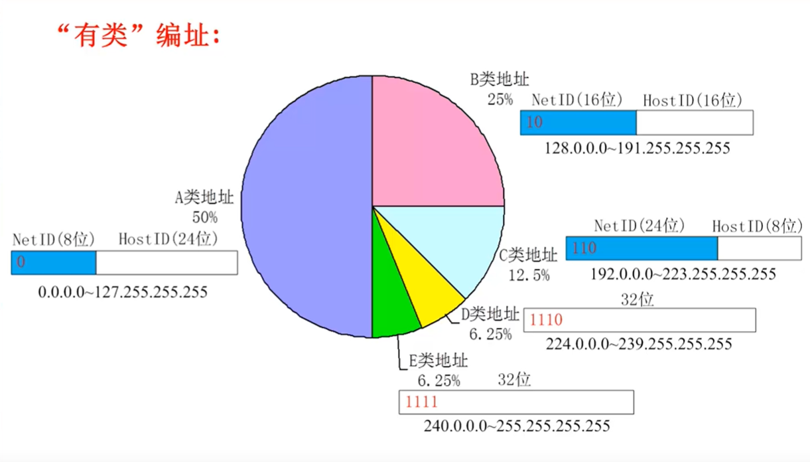
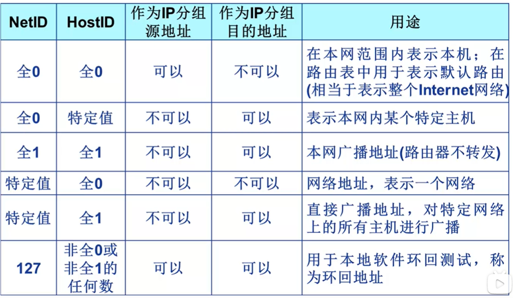
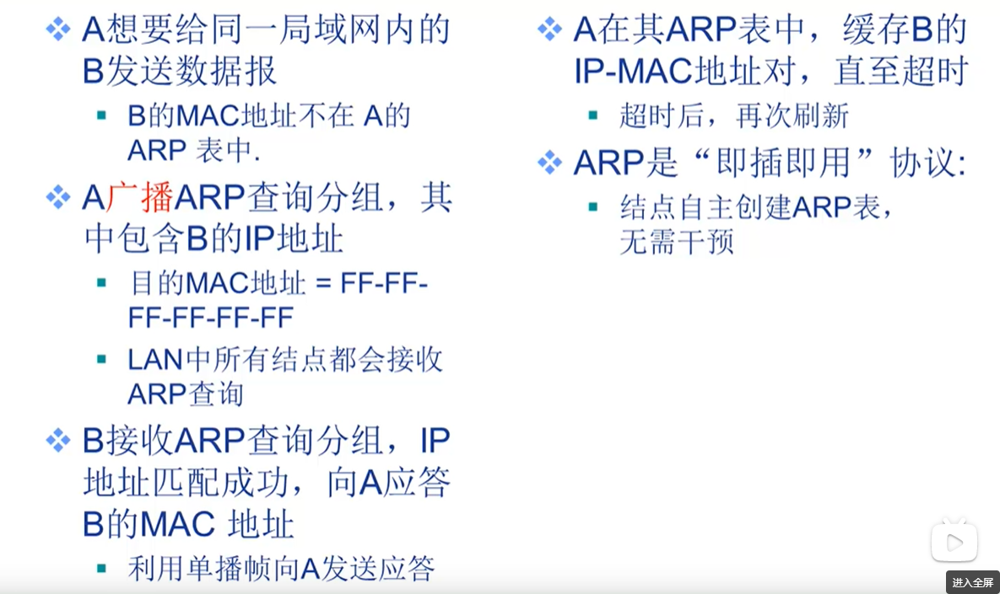
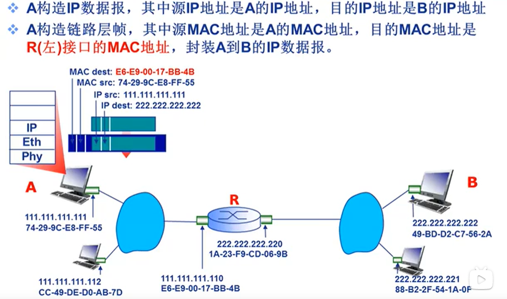
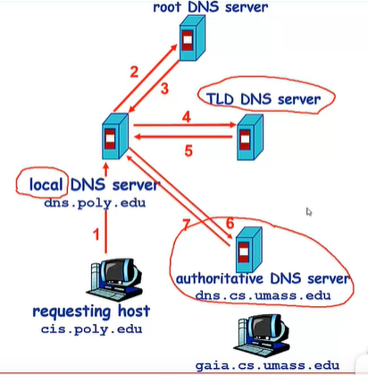
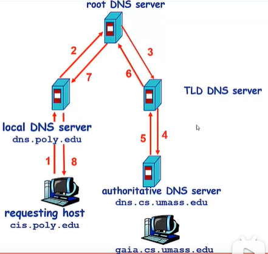
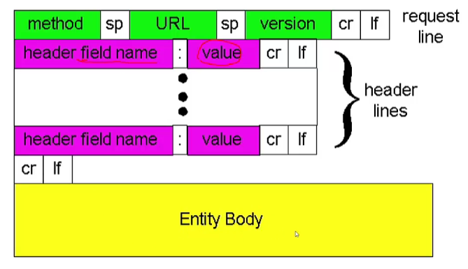
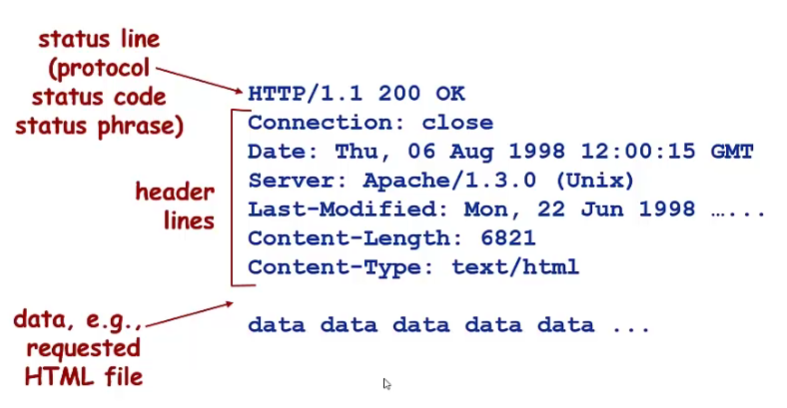

# 计算机网络
## 网络分层划分
 OSI七层模型，TCP/IP 4层/5层模型

 1.  物理层
物理层确保越是数据可在各种物理媒体上传输。两个重要的设备是中继器和集线器。
 
 2. 数据链路层
 物理寻址，同时将原市比特流变为逻辑传输线路。
 1.) 数据链路层为网络层提供可靠的数据传输
 2.) 基本数据单位为帧
 3.) 主要的协议：以太网协议
 4.）两个重要的设备：网桥和交换机
 
 3. 网络层
 1.) 网络层负责对子网间的数据包进行路由选择。此外，网络层还可以实现拥塞控制，网际互联等功能。
 2.）基本数据单位为IP数据报。
 3.）包含的协议有：
IP协议（Internet Protocol,互联网互联协议）
ICMP协议（Internet Control Message Protocol,因特网控制报文协议）
ARP协议（Address Resolution Protocol，地址解析协议）
RARP协议（Reserve Address Resolution Protocol,逆地址解析协议）
4.）重要的设备：路由器
 
4. 传输层
1.）传输层负责将上层数据分段并提供端对端的，可靠的、不可靠的的传输。此外，传输层还要处理端对端的差错控制和流量控制问题。
2.）包含的主要协议：TCP协议（Transmission Control Protocol），UDP（User Datagram Protocol）
3.）重要设备：网关
 
5. 会话层
会话层管理主机之间的会话进程，即负责建立、管理、终止进程之间的会话。会话层还利用在数据中插入校验点来实现数据的同步。
 
6. 表示层
表示层对上层数据或信息进行变换以保证一个主机应用层信息可以被另一个主机的应用程序理解。表示层的数据转换包括数据的加密、压缩、格式转换等。
 
7. 应用层
运输层(transport layer)的主要任务就是负责向两台主机进程之间的通信提供通用的数据传输服务。为操作系统或网络应用程序提供访问网络服务的接口。
1.) 数据传输基本单位为报文；
2.) 包含的主要协议：FTP（文件传送协议）、Telnet（远程登录协议）、DNS（域名解析协议）、SMTP（邮件传送协议），POP3协议（邮局协议），HTTP协议（Hyper Text Transfer Protocol）

## 网际协议IP
- IP分组：
    - 原地址（SA）
    - 目的地之（DA）
- 接口（interface）：主机、路由器与物理链路的连接
    - 实现网络层功能
    - 路由器通常有多个接口
    - 主机通常只有一个或两个接口

- IP地址：32比特（IPv4）编号识别主机、路由器的接口
    - 网络号（NetID）- 高比特位
    - 主机号（HostID）- 低比特位
- IP子网
    - IP地址具有相同网络号的设备接口
    - 不跨越路由器（第三方以及以上上层网络设备）可以彼此物理联通的接口

### 有类IP地址
　　A类地址以0开头，第一个字节作为网络号，地址范围为：0.0.0.0~127.255.255.255；(modified @2016.05.31)

　　B类地址以10开头，前两个字节作为网络号，地址范围是：128.0.0.0~191.255.255.255;

　　C类地址以110开头，前三个字节作为网络号，地址范围是：192.0.0.0~223.255.255.255。

　　D类地址以1110开头，地址范围是224.0.0.0~239.255.255.255，D类地址作为组播地址（一对多的通信）；

　　E类地址以1111开头，地址范围是240.0.0.0~255.255.255.255，E类地址为保留地址，供以后使用。

特殊IP地址

### IP子网与子网划分
IP地址
- 网络号 NetID 
- 子网号 SubID 原网络主机号部分比特
- 主机号 HostID

| NetID | SubID | HostID |
|--|--|--|

__子网掩码__
形如IP地址：
- 32位
- 点分十进制

取值：
- NetID, SubID位全取1
- HostID位全取0

例如：
- A网的默认子网掩码为：255.0.0.0
- B网的默认子网掩码为：255.255.0.0
- C网的默认子网掩码为：255.255.255.0
- 借用3比特划分子网的B网的子网掩码为：255.255.224.0

### MAC地址
作用：用于局域网内表示一个帧从哪个接口出发，到达哪个物理相连的其他接口。
48位MAC地址（大部分永不LANs），固化在网卡的ROM中，又是也可以软件设置。e.g. 1A-2F-BB-76-09-AD （16进制）
局域网中的每块网卡都有一个唯一的MAC地址。
MAC地址有IEEE统一管理和分配。

### ARP：地址解析协议
地址解析协议，即ARP（Address Resolution Protocol），是根据IP地址获取物理地址的一个TCP/IP协议。主机发送信息时将包含目标IP地址的ARP请求广播到网络上的所有主机，并接收返回消息，以此确定目标的物理地址；收到返回消息后将该IP地址和物理地址存入本机ARP缓存中并保留一定时间，下次请求时直接查询ARP缓存以节约资源。
ARP命令可用于查询本机ARP缓存中IP地址和MAC地址的对应关系、添加或删除静态对应关系等。
ARP表：LAN中的每个IP节点（主机、路由器）维护一个表。
- 存贮某些LAN节点的IP/MAC地址映射关系
    <IP地址，MAC地址，TTL>
- TTL（Time To Live）经过这个时间以后该映射关系会被遗弃）

__ARP协议，在同一局域网内__

 __寻址：从一个LAN路由至另一个LAN__

帧从A发送至R
R接受帧，提取IP数据报，传递给上层IP协议
R转发IP数据包（源和目的IP地址不变）
R创建链路层帧，其中源Mac地址是R接口的MAC地址，目的MAC地址是B的MAC地址，封装A到B的IP数据报。

## TCP/UDP协议
### TCP/IP协议
TCP/IP协议是Internet最基本的协议、Internet国际互联网络的基础，由网络层的IP协议和传输层的TCP协议组成。通俗而言：TCP负责发现传输的问题，一有问题就发出信号，要求重新传输，直到所有数据安全正确地传输到目的地。而IP是给因特网的每一台联网设备规定一个地址。
IP层接收由更低层（网络接口层例如以太网设备驱动程序）发来的数据包，并把该数据包发送到更高层---TCP或UDP层；相反，IP层也把从TCP或UDP层接收来的数据包传送到更低层。IP数据包是不可靠的，因为IP并没有做任何事情来确认数据包是否按顺序发送的或者有没有被破坏，IP数据包中含有发送它的主机的地址（源地址）和接收它的主机的地址（目的地址）。
TCP是面向连接的通信协议，通过三次握手建立连接，通讯完成时要拆除连接，由于TCP是面向连接的所以只能用于端到端的通讯。TCP提供的是一种可靠的数据流服务，采用“带重传的肯定确认”技术来实现传输的可靠性。TCP还采用一种称为“滑动窗口”的方式进行流量控制，所谓窗口实际表示接收能力，用以限制发送方的发送速度。

#### 三次握手

简单来说TCP连接建立过程：首先Client端发送连接请求报文，Server段接受连接后回复ACK报文，并为这次连接分配资源。Client端接收到ACK报文后也向Server段发生ACK报文，并分配资源，这样TCP连接就建立了。

详细来说：客户端在需要时，向服务器发起请求连接报文，发出后状态从CLOSED转换为SYN-SEND  同步-已发送状态
服务器一直处于LISTEN状态，接收到请求后，对客户端的请求进行回应，转换为SYN-RCVD，同步-已收到状态
客户端收到服务器的回应后，状态转换为ESTABLISHED，并且再次向服务器发送确认
服务器收到客户端的确认之后，服务器也转换为ESTABLISHED状态，完成了连接

为什么要三次挥手？
在只有两次“握手”的情形下，假设Client想跟Server建立连接，但是却因为中途连接请求的数据报丢失了，故Client端不得不重新发送一遍；这个时候Server端仅收到一个连接请求，因此可以正常的建立连接。但是，有时候Client端重新发送请求不是因为数据报丢失了，而是有可能数据传输过程因为网络并发量很大在某结点被阻塞了，这种情形下Server端将先后收到2次请求，并持续等待两个Client请求向他发送数据...问题就在这里，Cient端实际上只有一次请求，而Server端却有2个响应，极端的情况可能由于Client端多次重新发送请求数据而导致Server端最后建立了N多个响应在等待，因而造成极大的资源浪费！所以，“三次握手”很有必要！

#### 四次挥手

==客户端无数据发送时，请求关闭连接==，我好了，我想断开连接了（FIN=1）我的序号是u（u就是之前传送过的所有数据的最后一个字节的序号+1）。==此时客户端转变为FIN-WAIT-1状态。==
==服务器收到客户端的消息后，告诉客户端“好的，我知道了”==（ACK=1，ack=u+1），这条消息的序号是v（seq=v ，这是服务器发送消息的序号)。==此时服务器的状态就转换为了CLOSE-WAIT状态。此时，客户端通往服务器的路就断开了，客户端不能向服务器发送数据。但是服务器仍旧可以向客户端发送数据==，现在是“半关闭”的状态。==当客户端收到来自服务器的确认之后，进入FIN-WAIT-2状态，等待服务器那边说断开连接，等待中。。。。。==

==当服务器所有的数据也都完全发送完成了之后，服务器才开始主动告知客户端断开连接==（FIN=1，seq=w）。这中间服务器可能又继续发送了一些数据，可能是v+1 也可能发送了更多，所以设置为w。==并且再次发送确认信息（ACK=1，ack=u+1==，因为客户端已经不能发送数据了，服务器期望收到的序号永远都是最后一个序号+1，也就是u+1）。==这时，服务器就进入了LAST-ACK状态，最后确认状态。客户端收到了服务器的断开连接请求后，也需要给出确认响应（ACK=1，ack=w+1，seq=u+1），然后进入TIME-WAIT状态。==
==等待两个MSL后，进入关闭状态==
MSL 是Maximum Segment Lifetime英文的缩写“报文最大生存时间”，他是任何报文在网络上存在的最长时间，超过这个时间报文将被丢弃。
服务器最终收到来自客户端的确认信息后，关闭，进入CLOSED状态

为什么要四次挥手？
说白了就是保证双方的一个合约的完整执行！

### UDP协议
UDP用户数据报协议，是面向无连接的通讯协议，UDP数据包括目的端口号和源端口号信息，由于通讯不需要连接，所以可以实现广播发送。UDP通讯时不需要接收方确认，属于不可靠的传输，可能会出现丢包现象，实际应用中要求程序员编程验证。UDP与TCP位于同一层，但它不管数据包的顺序、错误或重发。

#### TCP/UDP的区别
TCP面向连接，UDP面向非连接即发送数据前不需要建立链接
TCP提供可靠的服务（数据传输），UDP无法保证
TCP面向字节流，UDP面向报文
TCP数据传输慢，UDP数据传输快
在一个TCP连接中，仅有两方进行彼此通信，因此广播和多播不能用于TCP

#### TCP/UDP的应用场景
TCP：当对网络通讯质量有要求的时候，比如：整个数据要准确无误的传递给对方，这往往用于一些要求可靠的应用，比如HTTP、HTTPS、FTP等传输文件的协议，POP、SMTP等邮件传输的协议。 
UDP：当强调传输性能而不是传输的完整性时， 要求网络通讯速度能尽量的快。比如，直播，语音通话等。

## DNS
Domain Name System 域名解析系统
- 域名向IP地址的翻译
分布式层次式数据库
- 根服务器
    本地域名解析服务器无法解析域名是，访问根域名服务器
    根域名服务器
    - 如果不知道映射，访问权威域名服务器
    - 获得映射
    - 向本地域名服务器反回映射
- 顶级域服务器
负责com,org,net,edu等顶级域名和国家顶级域名
- 大型的公司服务器

本地域名解析服务器
不严格属于层级体系
每个ISP有一个本地域名服务器
-   默认域名解析服务器
当服务器DNS查询时，查询被 发送到本地域名服务器
- 作为代理（proxy），将查询转发给（层级式）域名解析服务器系统。

### DNS查询示例
#### 迭代查询

#### 递归查询

### HTTP链接类型
- 非持久性链接(Nonpersistent HTTP)
    - 每个TCP链接最多允许传输一个对象
    - HTTP 1.0版本使用非持久性连接
    - RTT（round trip time）
        Total=2TTR+文件发送时间
- 持久性链接（Persistent HTTP)
    - 每个TCP链接允许传输多个对象
    - HTTP 1.1版本默认使用持久性连接
    - 发送响应后，服务器保持TCP连接的打开
    - 后续的HTTP消息可以通过这个连接发送
    - 无流水（pipeline）的持久性连接
        - 客户端只有收到一个响应后才发送新的请求
        - 每个被引用的对象耗时1个RTT
    - 带有流水机制的持久性连接
        - 客户端只要遇到一个引用对象就尽快发出请求
        - 理想情况下，收到的所有引用对象只需耗时约1个RTT

### HTTP请求消息
- 请求消息（request）
    
    上传输入的方法
    - POST方法
        - 网页填写form
        - 在请求消息的消息体（entity body）中上传客户端的输入
    - URL方法
        - 使用get方法
        - 输入信息通过request行的url字段上传
- 响应消息（response）
    
    HTTP响应状态代码
    

方法的类型
GET 
POST
HEAD 请Server不要将请求的对象放入响应消息中
PUT 将消息体中的文件上传到URL字段所指定的路径
DELETE 删除URL字段所指定的文件

·