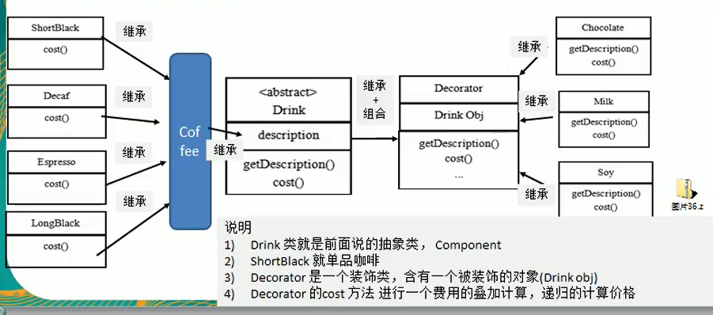

## 适配器模式 Adapter
将一个类的接口转换成客户希望的另外一个接口，使得原本由于接口不兼容而不能一起工作的那些类能一起工作。适配的意思是适应、匹配。通俗地讲，适配器模式适用于有相关性但不兼容的结构，源接口通过一个中间件转换后才可以适用于目标接口，这个转换过程就是适配，这个中间件就称之为适配器。

PS:适配器模式就像是一个补丁，只有在遇到接口无法修改时才应该考虑适配器模式。如果接口可以修改，那么将接口改为一致的方式会让程序结构更加良好。

类适配器
```java
//首先，家庭电源只提供220v电压
class HomeBattery {
    int supply() {
        // 家用电源提供一个 220V 的输出电压
        return 220;
    }
}
//usb数据线只能接受5v的充电电压
class USBLine {
    void charge(int volt) {
        // 如果电压不是 5V，抛出异常
        if (volt != 5) throw new IllegalArgumentException("只能接收 5V 电压");
        // 如果电压是 5V，正常充电
        System.out.println("正常充电");
    }
}
//这时我们加入适配器
class Adapter {
    int convert(int homeVolt) {
        // 适配过程：使用电阻、电容等器件将其降低为输出 5V
        int chargeVolt = homeVolt - 215;
        return chargeVolt;
    }
}
//然后，用户在使用适配器将家庭电源提供的电压转换为充电电压
public class User {
    @Test
    public void chargeForPhone() {
        HomeBattery homeBattery = new HomeBattery();
        int homeVolt = homeBattery.supply();
        System.out.println("家庭电源提供的电压是 " + homeVolt + "V");

        Adapter adapter = new Adapter();
        int chargeVolt = adapter.convert(homeVolt);
        System.out.println("使用适配器将家庭电压转换成了 " + chargeVolt + "V");

        USBLine usbLine = new USBLine();
        usbLine.charge(chargeVolt);
    }
}
```

对象适配器
```java
//在适配器内包含我们的src对象类
class Adapter {
    HomeBattery homevolt;

    public Adapter(HomeBattery homevolt){
        this.homevolt = homevolt;
    }

    int convert() {
        // 适配过程：使用电阻、电容等器件将其降低为输出 5V
        int chargeVolt = homeVolt.supply() - 215;
        return chargeVolt;
    }
}

public class User {
    @Test
    public void chargeForPhone() {
        HomeBattery homeBattery = new HomeBattery();
        int homeVolt = homeBattery.supply();
        System.out.println("家庭电源提供的电压是 " + homeVolt + "V");
        
        Adapter adapter = new Adapter(homeBattery);
        int chargeVolt = adapter.convert();
        System.out.println("使用适配器将家庭电压转换成了 " + chargeVolt + "V");

        USBLine usbLine = new USBLine();
        usbLine.charge();
    }
}
```
对象适配器和类适配器其实算同一种思想，只不过实现方式不同。根据合成复用原则，使用组合替代继承，所以它解决了类适配器必须继承src的局限性问题，也不再要求dst必须是接口。
使用成本更低，更灵活。

接口适配器模式
 当不需要全部实现接口提供的方法是，可先设计一个抽象类实现接口，并为该接口中的每个方法一共一个默认实现，那么该抽象类的子类可以有选择的覆盖弗雷德某些方法来实现需求。

# 装饰模式 Decorator
装饰模式也一样，它的主要作用就是：
- 增强一个类原有的功能
- 为一个类添加新的功能

并且装饰模式也不会改变原有的类

装饰模式：动态地给一个对象增加一些额外的职责，就增加对象功能来说，装饰模式比生成子类实现更为灵活。其别名也可以称为包装器，与适配器模式的别名相同，但它们适用于不同的场合。根据翻译的不同，装饰模式也有人称之为“油漆工模式”。
 
装饰者包含被装饰者。


# 代理模式（Proxy）
代理模式：给某一个对象提供一个代理，并由代理对象控制对原对象的引用。
静态代理
静态代理在使用时，需要定义接口或者父类，被代理对象与代理对象一起实现相同的接口或者是继承相同父类。
```java
//新建网络请求接口
public interface IHttp {
    void request(String sendData);

    void onSuccess(String receivedData);
}
//新建Http请求工具类：
public class HttpUtil implements IHttp {
    @Override
    public void request(String sendData) {
        System.out.println("网络请求中...");
    }

    @Override
    public void onSuccess(String receivedData) {
        System.out.println("网络请求完成。");
    }
}
//新建Http代理类：
public class HttpProxy implements IHttp {
    private final HttpUtil httpUtil;

    public HttpProxy(HttpUtil httpUtil) {
        this.httpUtil = httpUtil;
    }

    @Override
    public void request(String sendData) {
        httpUtil.request(sendData);
    }

    @Override
    public void onSuccess(String receivedData) {
        httpUtil.onSuccess(receivedData);
    }
}

//我们在HttpProxy中新增打印日志
public class HttpProxy implements IHttp {
    private final HttpUtil httpUtil;

    public HttpProxy(HttpUtil httpUtil) {
        this.httpUtil = httpUtil;
    }

    @Override
    public void request(String sendData) {
        System.out.println("发送数据:" + sendData);
        httpUtil.request(sendData);
    }

    @Override
    public void onSuccess(String receivedData) {
        System.out.println("收到数据:" + receivedData);
        httpUtil.onSuccess(receivedData);
    }
}
//客户端验证
public class Client {
    @Test
    public void test() {
        HttpUtil httpUtil = new HttpUtil();
        HttpProxy proxy = new HttpProxy(httpUtil);
        proxy.request("request data");
        proxy.onSuccess("received result");
    }
}
```
缺点：代理和被代理对象都要实现一样的接口

动态代理
这里需要用到反射技术
```java
public class HttpProxy implements InvocationHandler {
    private HttpUtil httpUtil;

    public IHttp getInstance(HttpUtil httpUtil) {
        this.httpUtil = httpUtil;
        return (IHttp) Proxy.newProxyInstance(httpUtil.getClass().getClassLoader(), httpUtil.getClass().getInterfaces(), this);
    }

    // 调用 httpUtil 的任意方法时，都要通过这个方法调用
    @Override
    public Object invoke(Object proxy, Method method, Object[] args) throws Throwable {
        Object result = null;
        if (method.getName().equals("request")) {
            // 如果方法名是 request，打印日志，并调用 request 方法
            System.out.println("发送数据:" + args[0]);
            result = method.invoke(httpUtil, args);
        } else if (method.getName().equals("onSuccess")) {
            // 如果方法名是 onSuccess，打印日志，并调用 onSuccess 方法
            System.out.println("收到数据:" + args[0]);
            result = method.invoke(httpUtil, args);
        }
        return result;
    }
}
```
